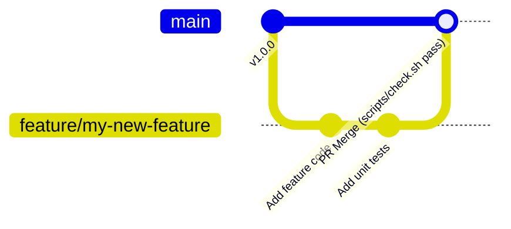

# Contribution Guidelines

Thank you for considering contributing to **bible_app_bg**! This document outlines coding standards, git workflows, and contribution policies.

## Contribution terms

**Code and documentation you contribute are licensed under the [MIT License](LICENSE)**, the
same terms that cover the rest of this repository. You keep your copyright; you grant everyone else
the same permissions the project already grants. No separate agreement, no sign-off, nothing to
sign — opening a pull request is the whole of it.

**Content you contribute is dedicated to the public domain under
[CC0 1.0](LICENSES/CC0-1.0.txt)**, not MIT. "Content" means text rather than software: a
translation, a correction to a historical text, a rendering into Bulgarian, editorial notes on a
source. MIT is a software licence and sits badly on a translated confession; CC0 matches what this
project already does — the Bulgarian 1689 Baptist Confession is CC0, and it is the precedent the
rest should follow. See [`NOTICE`](NOTICE) for the terms attached to every work already here.

**Do not contribute text you did not write or that is not free of restrictions.** Two cases, and
they need different things from you:

- **You wrote it** — a translation, a rendering, editorial notes. Say so, and the CC0 dedication
  above applies.
- **You did not write it** — a corrected reading from a printed edition, text from another source.
  Send its **provenance**: where it came from, who holds the rights, and why it may be
  redistributed. A contribution without that cannot be accepted however good it is, because the
  project cannot record terms it does not know.

Either way the result is recorded in [`NOTICE`](NOTICE), which is the authoritative statement of
what every distributed text is under.
[Content Provenance & Licensing](docs/extra/content-and-licensing.md) shows the per-work summary —
it describes what already ships, not the terms asked of you, which are the two clauses above.

If any of this does not suit a contribution you want to make, say so in the pull request rather
than staying silent. An exception recorded in the open is workable; an unstated one is not.

## Development Principles

1. **Maintain Zero-Server-State**: Never introduce server-side user accounts, session state, or mutable databases in `apps/api`.
2. **Preserve Content Attribution**: Never commit scripture or commentary texts without explicit license verification and attribution records.
3. **Respect Code Boundaries**:
   - `apps/web` talks only to `/api/v1` (never touches the SQLite DB directly).
   - `apps/api` reads SQLite in `mode=ro` (never writes or parses source formats).
   - `apps/importer` is the sole writer of `content.sqlite`.

## Pull Request Workflow

1. **Branch Naming**: Use descriptive branch names (e.g. `feature/confession-search`, `fix/mobile-tab-scroll`).
2. **Run Quality Checks**: Verify `./scripts/check.sh` passes completely on your local machine before creating a PR.
3. **Commit Messages**: Write concise commit messages following standard conventions (`feat: ...`, `fix: ...`, `docs: ...`).
