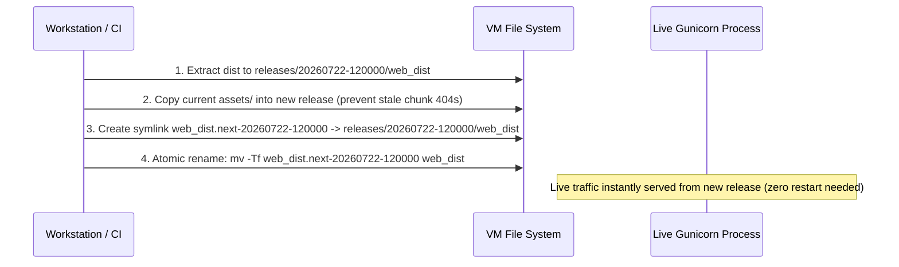

# Zero-Downtime Releases, Backups & Rollback

This runbook outlines zero-downtime release workflows, automated database backup procedures, and emergency rollback operations.

## Atomic SPA Release & Symlink Swapping

SPA deployments copy new build assets into versioned release directories (`releases/<ts>/web_dist`) and atomically update the active `web_dist` symlink using `rename(2)`.



### Atomic Symlink Swap Command
```bash
TS=$(date -u +%Y%m%d-%H%M%S)
RELEASE=releases/$TS/web_dist
NEXT=web_dist.next-$TS

mkdir -p "$RELEASE"
if test -d web_dist/assets; then cp -aL web_dist/assets "$RELEASE"/; fi
tar xzf web_dist.tar.gz -C "$RELEASE"
find "$RELEASE/assets" -type f -mtime +7 -delete

ln -s "$RELEASE" "$NEXT" && mv -Tf "$NEXT" web_dist
ls -1dt releases/*/ | tail -n +6 | xargs -r rm -rf # Keep last 5 releases
```

---

## Content Database Backup & Atomic Replacement

### Online Database Snapshot
Because `content.sqlite` is read-only, online backups are created safely using Python's SQLite `backup()` API:

```python
import sqlite3
import datetime

ts = datetime.datetime.now(datetime.timezone.utc).strftime("%Y%m%d-%H%M%S")
src = sqlite3.connect("file:/opt/bible-app/bible-app/data/content.sqlite?mode=ro", uri=True)
dst = sqlite3.connect(f"/opt/bible-app/bible-app/backups/content-{ts}.sqlite")
src.backup(dst)
dst.close()
src.close()
```

### Database Update Procedure
To rebuild or update scripture databases without corrupting running worker threads:
1. Build new DB to a temporary file on the **same filesystem**: `data/content.new.sqlite`.
2. Atomically rename: `mv -f data/content.new.sqlite data/content.sqlite`.
3. Restart systemd unit: `sudo systemctl restart bible-app`.

---

## Emergency Rollback Procedures

### SPA Rollback
Atomically revert the active symlink to the previous release folder:
```bash
PREVIOUS="$(ls -1dt releases/*/ | sed -n 2p)web_dist"
NEXT="web_dist.next-$(date -u +%Y%m%d-%H%M%S)"
ln -s "$PREVIOUS" "$NEXT" && mv -Tf "$NEXT" web_dist
```

### Database Rollback
```bash
cp ~/bible-app/backups/content-<previous-ts>.sqlite ~/bible-app/data/content.restore.sqlite
mv -f ~/bible-app/data/content.restore.sqlite ~/bible-app/data/content.sqlite
sudo systemctl restart bible-app
```
