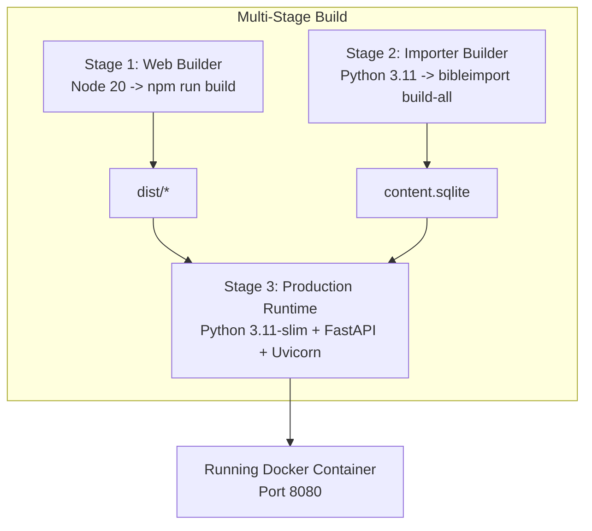

# Hosting & Deployment Options

`bible_app_bg` supports two production hosting strategies: **Native Systemd + Gunicorn** (current live VM setup) and **Containerized Docker Deployment**.

## Option 1: Native Systemd + Gunicorn (VM Setup)

### Systemd Service Unit (`/etc/systemd/system/bible-app.service`)

```ini
[Unit]
Description=Bilingual Bible App FastAPI + SPA Service
After=network.target

[Service]
User=deploy
WorkingDirectory=/opt/bible-app/bible-app
ExecStart=/opt/bible-app/bible-app/.venv/bin/gunicorn app.main:app \
  -k uvicorn.workers.UvicornWorker \
  -w 3 \
  -b 127.0.0.1:8080
Restart=always
RestartSec=5

[Install]
WantedBy=multi-user.target
```

### Operational Commands
```bash
sudo systemctl status bible-app
sudo systemctl restart bible-app
sudo journalctl -u bible-app -n 100 --no-pager
```

---

## Option 2: Containerized Docker Setup

For Docker-based environments or container orchestrators, the repository includes a multi-stage [`deploy/Dockerfile`](file:///Users/hristo.trendafilov/mydev/bible_app_bg/deploy/Dockerfile) and [`deploy/docker-compose.yml`](file:///Users/hristo.trendafilov/mydev/bible_app_bg/deploy/docker-compose.yml).

### Docker Deployment Architecture



### Docker Compose Quickstart

```bash
# Build and launch production container
docker-compose -f deploy/docker-compose.yml up -d --build

# Verify container logs
docker-compose -f deploy/docker-compose.yml logs -f
```
