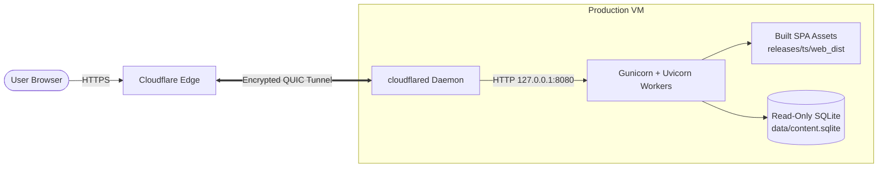

# Deployment & Operations Guide: Overview

This guide covers deployment topology, zero-downtime release procedures, Cloudflare Tunnel configuration, backups, and monitoring for **bible_app_bg**.

## Production Topology

## Core Deployment Principles

- **No direct Bible-app origin route**: Public Bible traffic reaches `127.0.0.1:8080` exclusively
  through `cloudflared`. The VM may expose ports for unrelated services, but there is no public Caddy
  vhost or direct-IP route for `bible.trendafilovi.net`.
- **Atomic Release Swaps**: Web SPA releases use atomic symlink replacement (`mv -Tf`). Content database updates use atomic file replacement (`mv -f`).
- **Read-Only Storage**: The application backend holds no mutable state and writes zero data to disk at runtime.

---

## Deployment Topics

- [Hosting Options](hosting-options.md) — Systemd + Gunicorn vs Docker containerization
- [Cloudflare Tunnel](cloudflare-tunnel.md) — Zero Trust tunnel, origin protection & CDN caching
- [Backups & Rollbacks](backups-and-rollback.md) — Atomic symlink swaps, live SQLite backups & rollback steps
- [Monitoring & Alerts](monitoring-and-alerts.md) — `/health` vs `/ready` probes & UptimeRobot monitoring
