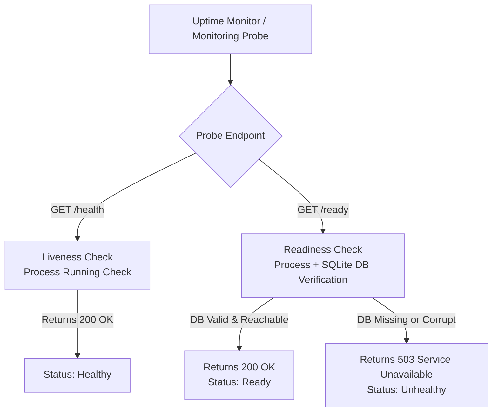

# Monitoring, Health Probes & Alerts

The production application is continuously monitored via HTTP readiness probes, external uptime pingers, and automated GitHub Actions alert workflows.

## Health Probe Architecture & Semantics

### Endpoint Definitions

| Probe Endpoint | Purpose | Checks Performed | Success Code | Failure Code |
|---|---|---|---|---|
| `GET /health` | Liveness | Verifies Python process is running | `200 OK` | Host down / Process dead |
| `GET /ready` | Readiness | Verifies process + queries `content.sqlite` works table | `200 OK` | `503 Service Unavailable` |

> [!IMPORTANT]
> External uptime monitors (such as UptimeRobot) **must probe `/ready`** rather than `/health`. This ensures alerts trigger if the database becomes corrupted, unreadable, or missing.

## Monitoring Infrastructure

1. **UptimeRobot (Primary)**:
   - Currently probes `https://bible.trendafilovi.net/health` every 5 minutes.
   - It should be changed to `/ready` so database failures are detected as well.
   - Email delivery still requires verification of the configured alert contact.

2. **GitHub Actions Uptime Workflow (Secondary)**:
   - File: [`.github/workflows/uptime.yml`](../../.github/workflows/uptime.yml).
   - Probes both public endpoints every 90 minutes with retries.
   - Automatically opens a deduplicated **`outage`** GitHub issue when probes fail, and closes it upon recovery.
