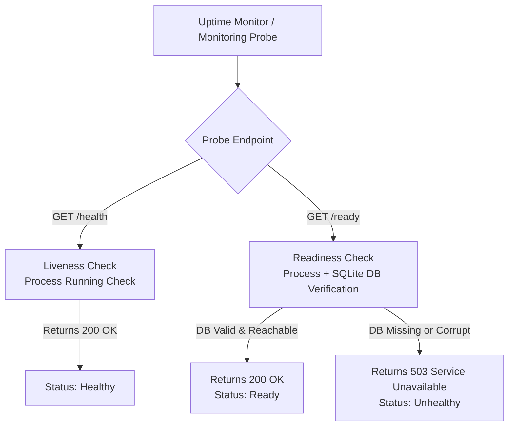

# Monitoring, Health Probes & Alerts

The production application is monitored by UptimeRobot through the public Cloudflare route. GitHub
Actions does not run a second uptime monitor.

## Health Probe Architecture & Semantics

### Endpoint Definitions

| Probe Endpoint | Purpose | Checks Performed | Success Code | Failure Code |
|---|---|---|---|---|
| `GET /health` | Liveness | Verifies Python process is running | `200 OK` | Host down / Process dead |
| `GET /ready` | Readiness | Verifies DB availability, schema version, and content checksums | `200 OK` | `503 Service Unavailable` |

> [!IMPORTANT]
> External uptime monitors (such as UptimeRobot) **must probe `/ready`** rather than `/health`. This ensures alerts trigger if the database becomes corrupted, unreadable, or missing.

## Monitoring Infrastructure

1. **UptimeRobot (sole uptime monitor)**:
   - Probe `https://bible.trendafilovi.net/ready` so database failures are detected as well as process
     and network failures.
   - Configure the desired interval and verify email delivery for the alert contact in UptimeRobot.
   - The former `.github/workflows/uptime.yml` monitor was removed before publication to avoid
     duplicate alerts and unnecessary Actions runs.

2. **Deployment Workflow (manual container path)**:
   - [`.github/workflows/publish-image.yml`](../../.github/workflows/publish-image.yml) is manual
     (`workflow_dispatch`). By default it only builds and pushes a commit-SHA + `latest` image to
     GHCR. Rolling that image out is a **separate, opt-in job**: tick `deploy_to_vm` on dispatch and
     it SSHes to the VM, pulls with Compose, and checks readiness. Left unticked, the rollout job is
     skipped and the run still succeeds.
   - It intentionally does not deploy on every commit. The generic native production procedures are
     documented in this guide ([hosting options](hosting-options.md),
     [backups & rollback](backups-and-rollback.md)); live operator values stay in the private
     runbook (see [`plan/deployment/README.md`](../../plan/deployment/README.md)).
