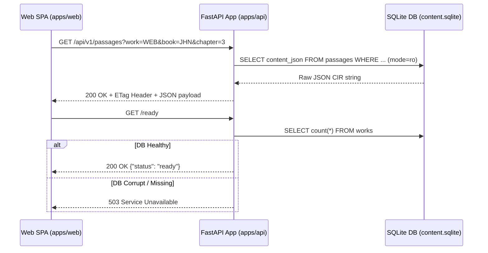

# Backend API Service (`apps/api`)

The backend API service is built with FastAPI in `apps/api/`. It provides high-speed, read-only scripture retrieval and FTS5 search.

## Request Pipeline & Router Architecture

## Router Layout & Endpoints

| Router File | Prefix | Key Endpoints | Purpose |
|---|---|---|---|
| `passages.py` | `/api/v1/passages` | `GET /` | Scripture passage JSON retrieval |
| `search.py` | `/api/v1/search` | `GET /` | Full-Text Search (FTS5) across works |
| `commentary.py` | `/api/v1/commentary` | `GET /` | Verse commentary retrieval (Matthew Henry) |
| `dictionary.py` | `/api/v1/dictionary` | `GET /`, `GET /{term}` | Dictionary term lookup (Easton's) |
| `general_books.py` | `/api/v1/general-books`| `GET /`, `GET /{id}/toc` | Confessions & General Books TOC and chapters |
| `xrefs.py` | `/api/v1/xrefs` | `GET /` | TSK cross-reference list and verse previews |
| `works.py` | `/api/v1/works` | `GET /` | List installed works and translation metadata |
| `health.py` | `/health`, `/ready` | `GET /health`, `GET /ready` | Liveness and readiness probes |

## OpenAPI Synchronization

The API contract is defined by FastAPI's auto-generated OpenAPI schema. When changing backend endpoints or response models (`app/models.py`), update the corresponding TypeScript interfaces in `apps/web/src/data/api.ts`.
