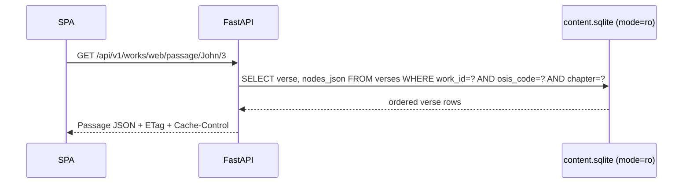

# Backend API Service (`apps/api`)

The FastAPI service exposes read-only content from SQLite and serves the built SPA in production. All
content endpoints are under `/api/v1`; `/health` and `/ready` are root-level probes.

## Request path

The API uses one read-only SQLite connection per request. Middleware attaches content-version-aware
ETags and public cache headers to successful `/api/v1` GET responses. Security headers, including the
Dropbox-aware Content Security Policy, are attached to every response.

## Implemented endpoints

| Endpoint | Purpose |
|---|---|
| `GET /health` | Process liveness |
| `GET /ready` | Database readiness and content version |
| `GET /api/v1/meta` | Content version and work count |
| `GET /api/v1/works` | Installed works and attribution metadata |
| `GET /api/v1/works/{work_id}/books` | Bible books and chapter counts |
| `GET /api/v1/works/{work_id}/passage/{osis}/{chapter}` | Complete Bible chapter CIR |
| `GET /api/v1/commentary/{work_id}/{osis}/{chapter}?verse=` | Commentary entries for a chapter/reference |
| `GET /api/v1/dictionary/{work_id}/entries?prefix=&limit=` | Dictionary headword list |
| `GET /api/v1/dictionary/{work_id}/entry/{headword}` | One dictionary entry |
| `GET /api/v1/books` | Installed General Book works |
| `GET /api/v1/book/{work_id}` | General Book TOC tree and all section bodies |
| `GET /api/v1/xref/{osis}/{chapter}/{verse}?preview_work=` | Cross-references and previews |
| `GET /api/v1/search?q=&works=&limit=&offset=` | Bible FTS5 search |

FastAPI's generated OpenAPI schema is the runtime contract. When changing response models in
`apps/api/app/models.py`, update the matching interfaces and fetch functions in
`apps/web/src/data/api.ts`.
