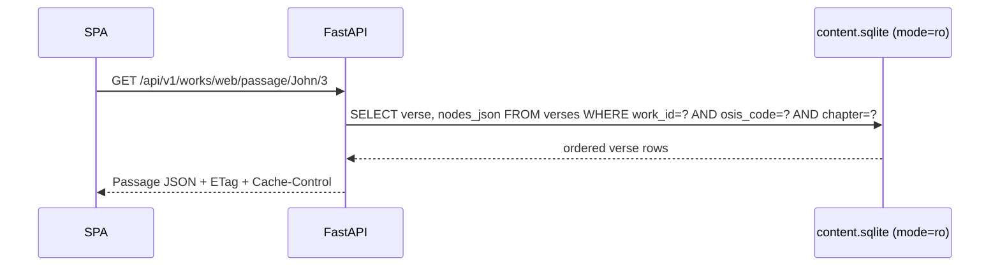

# Backend API Service (`apps/api`)

The FastAPI service exposes read-only content from SQLite and serves the built SPA in production. All
content endpoints are under `/api/v1`; `/health` and `/ready` are root-level probes.

## Request path

The API uses one read-only SQLite connection per request. Middleware attaches content-version-aware
ETags and public cache headers to successful `/api/v1` GET responses. Security headers, including the
Dropbox-aware Content Security Policy, are attached to every response. The public read-only API also
returns `Access-Control-Allow-Origin: *` so the external `embed.js` widget can fetch scripture from
another site; SPA/HTML responses do not get that CORS header.

The importer writes a SQLite `PRAGMA user_version`. Startup records the database status, `/ready`
returns `503` with `status: "schema-outdated"` when that version is incompatible, and API middleware
rejects content requests clearly instead of allowing a later missing-column SQL error.

## Implemented endpoints

| Endpoint | Purpose |
|---|---|
| `GET /health` | Process liveness |
| `GET /ready` | Database readiness, schema version, and content version |
| `GET /api/v1/meta` | Content version and work count |
| `GET /api/v1/works` | Installed works and attribution metadata |
| `GET /api/v1/works/{work_id}/books` | Bible books and chapter counts |
| `GET /api/v1/works/{work_id}/passage/{osis}/{chapter}?verses=` | Bible chapter CIR (optional `verses=16` or `1-19` range) |
| `GET /api/v1/commentary/{work_id}/{osis}/{chapter}?verse=` | Commentary entries for a chapter/reference |
| `GET /api/v1/dictionary/{work_id}/entries?prefix=&limit=` | Dictionary headword list |
| `GET /api/v1/dictionary/{work_id}/entry/{headword}` | One dictionary entry |
| `GET /api/v1/books` | Installed General Book works |
| `GET /api/v1/book/{work_id}` | General Book TOC tree and all section bodies |
| `GET /api/v1/xref/{osis}/{chapter}/{verse}?preview_work=` | Cross-references and previews |
| `GET /api/v1/search?q=&refine=&types=&works=&canon=&books=&languages=&sort=&limit=&offset=` | Unified FTS5 search across Bible/commentary/dictionary/General Book; grouped totals, typed hits, filters, ordering, and stable pagination |

FastAPI's generated OpenAPI schema is the runtime contract. When changing response models in
`apps/api/app/models.py`, update the matching interfaces and fetch functions in
`apps/web/src/data/api.ts`.

### Unified search contract

`q` and optional `refine` are safely tokenized; all terms are combined with `AND` rather than
accepting raw FTS syntax. `types`, `works`, `books`, and `languages` are comma-separated, size-capped
filters. `canon=ot|nt` and `books=` affect Bible and reference-bound commentary; dictionary and
General Book providers ignore canonical range filters. Work and language filters apply to every
provider.

A request for several types returns a five-hit preview per group. A single `types=` value uses the
requested `limit` (1–100) and `offset` (up to 100,000). Every group includes `total`, `offset`,
`limit`, `has_more`, and a typed locator: canonical verse, stable commentary entry, dictionary
headword, or General Book section.

`sort=relevance` uses provider-specific BM25 ranking with deterministic source-order tie-breakers.
`sort=canonical` means canonical verse/reference order, alphabetical dictionary headword order, or
General Book section order. Count and page queries share the same filters, so totals and pagination
remain stable.

Document bodies (`Document.blocks[].runs[]`) carry inline markup: `emphasis`/`strong`/`superscript`
flags, a `ref` field with a canonical scripture target (`John.3.16`, `John.3.1-19`, or chapter-only
`Num.12`), and a mutually exclusive `dictionary_ref` object
(`{work_id, entry_key, headword}`) for internal dictionary links.
