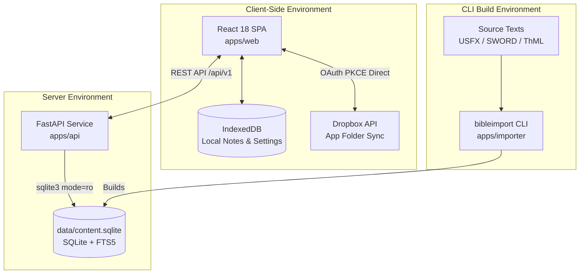
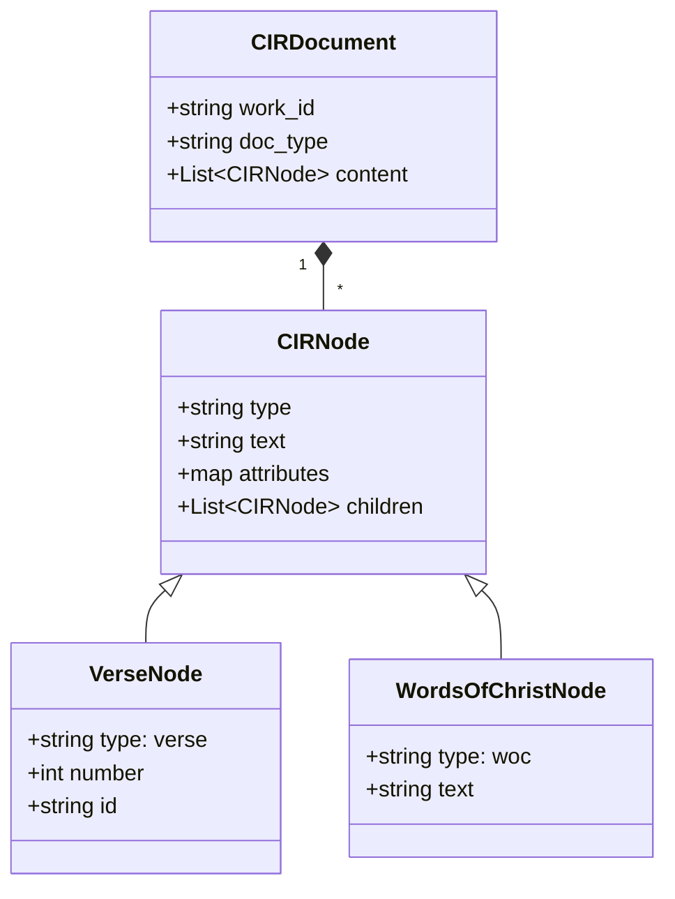

# Architecture Overview & CIR Model

This document describes the architectural boundaries and the **Canonical Intermediate Representation (CIR)** data model used across `bible_app_bg`.

## System Boundaries & Component Map

## Immutable Architecture Principle

1. **Zero Server State**: The production server (`apps/api`) does not accept writes, execute user authentication, or store user session data.
2. **Read-Only SQLite**: The API opens `data/content.sqlite` with `mode=ro` and `PRAGMA query_only = ON`.
3. **Local-First Notes**: All notes, tags, and settings are created, edited, and rendered inside the browser via IndexedDB.

---

## Canonical Intermediate Representation (CIR)

Source Bible formats (USFX, OSIS, ThML, SWORD mod2imp) stop at the `apps/importer` boundary. All scripture and commentary texts are transformed into a canonical JSON AST structure before stored in SQLite.

### CIR Node Types

| Node Type | Purpose | Example / Attributes |
|---|---|---|
| `book` | Book container | `{ "type": "book", "id": "JHN" }` |
| `chapter` | Chapter container | `{ "type": "chapter", "number": 3 }` |
| `verse` | Verse text container | `{ "type": "verse", "number": 16, "id": "JHN.3.16" }` |
| `woc` | Words of Christ text | `{ "type": "woc", "text": "For God so loved the world..." }` |
| `heading` | Section header | `{ "type": "heading", "level": 2, "text": "The Love of God" }` |
| `poetry` | Poetic line rendering | `{ "type": "poetry", "indent": 1 }` |
