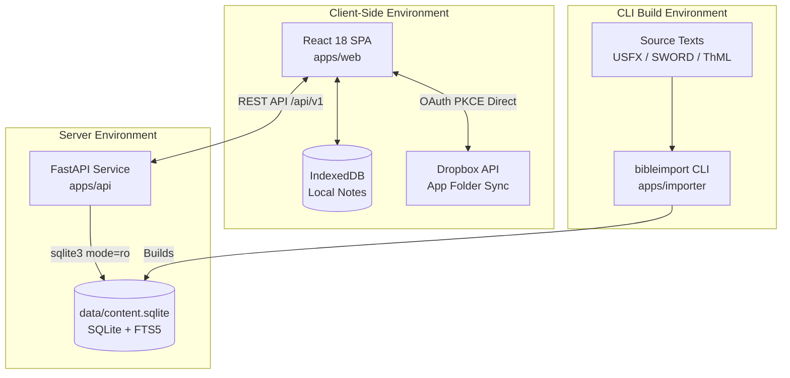
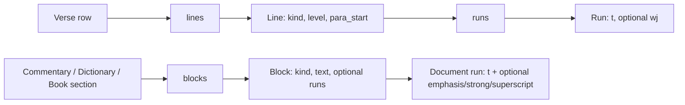

# Architecture Overview & CIR Model

This document describes the architectural boundaries and the **Canonical Intermediate Representation (CIR)** data model used across `bible_app_bg`.

## System Boundaries & Component Map



## Immutable Architecture Principle

1. **Zero Server State**: The production server (`apps/api`) does not accept writes, execute user authentication, or store user session data.
2. **Read-Only SQLite**: The API opens `data/content.sqlite` through SQLite's URI `mode=ro`, with one
   short-lived connection per request.
3. **Local-First State**: Notes and verse anchors live in IndexedDB. Pane layout and reading settings
   are persisted separately in `localStorage`; recent/pinned search history uses its own versioned
   `bible-search-v1` record. Dropbox sync remains browser-to-Dropbox and does not include search
   history.

---

## Canonical Intermediate Representation (CIR)

Source formats stop at the `apps/importer` boundary. The importer currently accepts WEB USFX, raw
SWORD `mod2imp` exports for Bibles/General Books/study works, optional CCEL ThML study sources, and the
TSV cross-reference mapping. Raw source markup never reaches the API client.



### Bible verse CIR

Each `verses.nodes_json` value has this shape:

```json
{
  "lines": [
    {
      "kind": "p",
      "level": 1,
      "para_start": true,
      "runs": [{ "t": "For God so loved…", "wj": true }]
    }
  ]
}
```

- `kind` is `p` (prose) or `q` (poetry); `level` carries poetry indentation.
- `para_start` lets the SPA reconstruct flowing paragraphs across verse records.
- `wj` marks words of Jesus. Headings are stored separately with `before_verse`.

### Study-document CIR

Commentary entries, dictionary entries, and General Book sections share `{"blocks": [...]}`. A block
is `heading`, `paragraph`, or `quotation`, with plain `text` and optional runs carrying `emphasis`,
`strong`, or `superscript` flags. A run may also carry a `ref` — a canonical scripture target
(`"John.3.16"` or `"John.3.1-19"`) preserved from the source's `<reference osisRef>` tags — which the
client renders as an interactive scripture pop-up. See `apps/api/app/models.py` and
`apps/web/src/render/DocumentRenderer.tsx` for the API/client contract.
