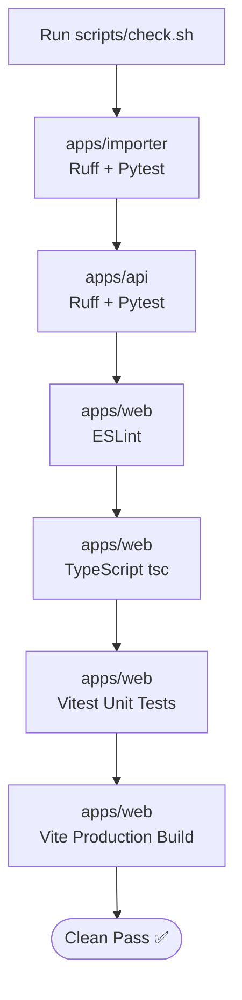

# Building, Testing & Quality Assurance

The repository maintains a strict quality bar. All linting, unit testing, type checking, and build checks are unified in a single command.

## Verification Pipeline Diagram



## Running Verification Commands

### 1. Canonical Check Entrypoint
Before opening a Pull Request or pushing changes, run the main check script:
```bash
./scripts/check.sh
```
This script executes the same verification suite used by GitHub Actions CI
([`.github/workflows/ci.yml`](../../.github/workflows/ci.yml)).

### 2. Frontend Unit Tests (Vitest)
```bash
cd apps/web
npm run test -- --run  # Run once
npm run test           # Watch mode in an interactive terminal
```

### 3. End-to-End Integration Tests (Playwright)
To execute full-stack E2E smoke tests and accessibility (`axe-core`) scans:
```bash
cd apps/web
npm run e2e
```
Playwright starts [`scripts/e2e-server.sh`](../../scripts/e2e-server.sh) through `webServer`, rebuilding
the content database and SPA unless `E2E_REUSE=1` is set. A local rebuild requires the SWORD
utilities (`mod2imp`), `curl`, and `unzip` so the checksum-pinned KJV input can be fetched; CI installs
them automatically. The manual GitHub workflow is
[`e2e.yml`](../../.github/workflows/e2e.yml).

### 4. Read-concurrency load smoke

Pytest includes a deterministic simultaneous-request test against the fixture database. For an actual
local or VM capacity smoke (kept out of timing-sensitive CI), run:

```bash
./scripts/load-smoke.py --url http://127.0.0.1:8080 \
  --concurrency 100 --requests 1000 --max-error-rate 0.01 --max-p95-ms 500
```

The command exits non-zero if more than 1% of requests fail or p95 exceeds 500 ms. Record the output
with the host/runtime details when using it to substantiate a capacity claim.

Reference local run (2026-07-24, macOS development machine, one Uvicorn process, current production
content): 1,000 requests at concurrency 100, 0 errors, p50 203.8 ms, p95 229.0 ms, 479.3 requests/s.
This verifies the code/read path; run it separately on the production VM after deployment to measure
that host.
