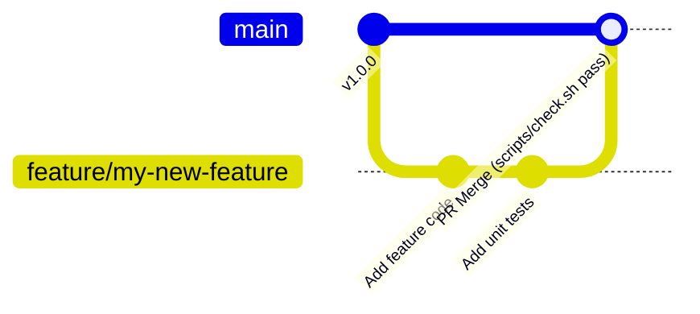

# Contribution Guidelines

Thank you for considering contributing to **bible_app_bg**! This document outlines coding standards, git workflows, and contribution policies.

## Development Principles

1. **Maintain Zero-Server-State**: Never introduce server-side user accounts, session state, or mutable databases in `apps/api`.
2. **Preserve Content Attribution**: Never commit scripture or commentary texts without explicit license verification and attribution records.
3. **Respect Code Boundaries**:
   - `apps/web` talks only to `/api/v1` (never touches the SQLite DB directly).
   - `apps/api` reads SQLite in `mode=ro` (never writes or parses source formats).
   - `apps/importer` is the sole writer of `content.sqlite`.

## Pull Request Workflow

1. **Branch Naming**: Use descriptive branch names (e.g. `feature/confession-search`, `fix/mobile-tab-scroll`).
2. **Run Quality Checks**: Verify `./scripts/check.sh` passes completely on your local machine before creating a PR.
3. **Commit Messages**: Write concise commit messages following standard conventions (`feat: ...`, `fix: ...`, `docs: ...`).
