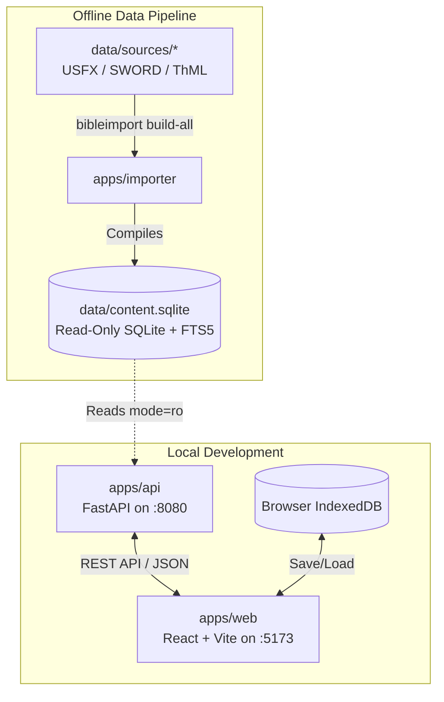

# Developer Guide: Quickstart & Setup

Welcome to the developer documentation for **DidacheDynamis**. This guide covers local environment setup, architecture principles, and building the project locally.

## Monorepo High-Level Workflow



## System Requirements

- **Python**: 3.11 or higher
- **Node.js**: 20.19+ or 22.12+ (Node 22 is used in CI and Docker)
- **Package Managers**: `pip`, `npm`
- **Git LFS**: required for the committed content sources under `data/sources`
- **OS**: macOS, Linux, or WSL2

## Step-by-Step Local Setup

### 1. Clone & Set Up Virtual Environments

```bash
git clone https://github.com/htrendafilov/DidacheDynamis.git
cd DidacheDynamis
git lfs install
git lfs pull

# Set up importer virtualenv
python3 -m venv apps/importer/.venv
. apps/importer/.venv/bin/activate
pip install -e "apps/importer[dev]"
deactivate

# Set up API virtualenv
python3 -m venv apps/api/.venv
. apps/api/.venv/bin/activate
pip install -e "apps/api[dev]"
deactivate
```

### 2. Build the Content Database

Build the single read-only SQLite database (`data/content.sqlite`) from the reviewed sources. KJV is
fetched from a checksum-pinned official CrossWire archive and stays outside Git:

```bash
. apps/importer/.venv/bin/activate
bash scripts/fetch-kjv.sh
bibleimport build-all --sources-dir data/sources --out data/content.sqlite
deactivate
```

### 3. Run Development Servers

After the setup above, the convenience script builds a missing DB and runs both processes:

```bash
./scripts/dev.sh
```

Set `REBUILD_CONTENT=1 ./scripts/dev.sh` after a schema/importer change. The equivalent separate
commands are:

Start the FastAPI backend (Port `8080`):
```bash
. apps/api/.venv/bin/activate
uvicorn app.main:app --app-dir apps/api --port 8080 --reload
```

In a second terminal, start the Vite SPA dev server (Port `5173`):
```bash
cd apps/web
npm ci
npm run dev
```

Open `http://localhost:5173/` in your browser.

---

## Developer Documentation Topics

- [Architecture Overview](architecture-overview.md) — System boundaries & Canonical Intermediate Representation (CIR)
- [Web SPA](web-spa.md) — React 18, Vite, Zustand layout engine & TipTap notes
- [API Service](api-service.md) — FastAPI endpoints, read-only SQLite & FTS5 queries
- [Importer CLI](importer-cli.md) — `bibleimport` format adapters & database compiler
- [Building & Testing](building-and-testing.md) — Check script, Pytest, Vitest & Playwright E2E
- [Contributing](../../CONTRIBUTING.md) — contribution terms, code style standards, PR workflow
