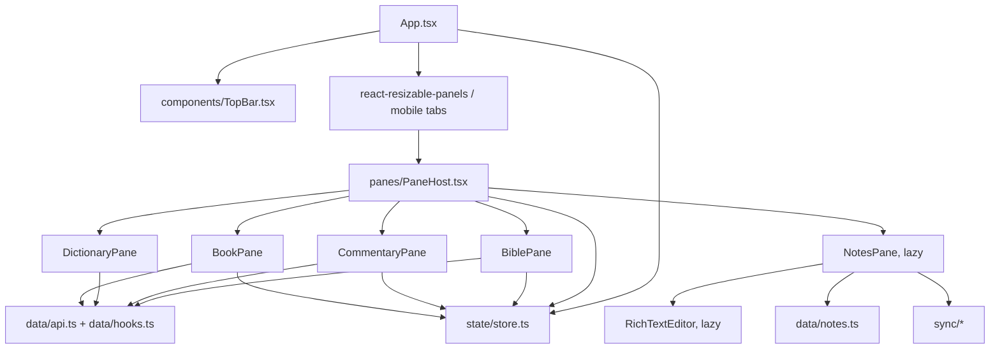

# Frontend Architecture & Web SPA (`apps/web`)

The frontend is a React 18 single-page application built with Vite, TypeScript, Zustand, plain CSS,
`react-resizable-panels`, i18next, Dexie, TipTap, and the Dropbox SDK. It does not use Tailwind or an
icon library.

## Component and state flow

## Key modules

- `src/App.tsx`: top-level panels, responsive mobile tab behavior, settings/search overlays, and
  Dropbox initialization.
- `src/panes/PaneHost.tsx`: routes each persisted pane record to its pane component; lazy-loads Notes.
- `src/render/CIRRenderer.tsx`: Bible verse CIR, verse layouts, poetry, headings, and words of Christ.
- `src/render/DocumentRenderer.tsx`: shared study-document CIR for commentary, dictionary, and books.
- `src/state/store.ts`: Zustand pane and reading settings state, persisted as `bible-app` in
  `localStorage`.
- `src/data/notes.ts`: Dexie schema and validated notes import/export in IndexedDB.
- `src/sync/`: Dropbox OAuth PKCE, transport, three-way merge, and sync state.
- `src/i18n/en.json`, `src/i18n/bg.json`: interface strings; `src/i18n/bookNames.ts` localizes canonical
  book names from OSIS codes.
- `src/styles/app.css`: application styles and responsive rules.

## Code splitting

`PaneHost` lazy-loads `NotesPane`; `NotesPane` then lazy-loads TipTap's `RichTextEditor`. The Dropbox SDK
is imported dynamically only during authorization or file transfer. This keeps notes/editor/cloud code
off the initial reading path.

## URL state

Pane and passage state persists locally (`localStorage`) and is **not** reflected in the URL, with one
exception: **General Book section deep links**. The active book pane's section is mirrored into the URL
hash as `#/book/<workId>/<sectionId>` (via `state/deeplink.ts`), using `history.replaceState` so it
never pollutes history or fires `hashchange`. On load — and on `hashchange` — a valid book hash opens
that section (`openBookSection`); a bogus work id is ignored. The hash is used (not the query string)
specifically so it can never collide with the Dropbox OAuth `?code`/`?state` params.

The broader canonical URL scheme for every pane type (Bible/commentary/dictionary + multi-pane layouts)
is still planned in `plan/linking_and_embeds.md` §1; do not document those route formats as implemented
until that work lands.
