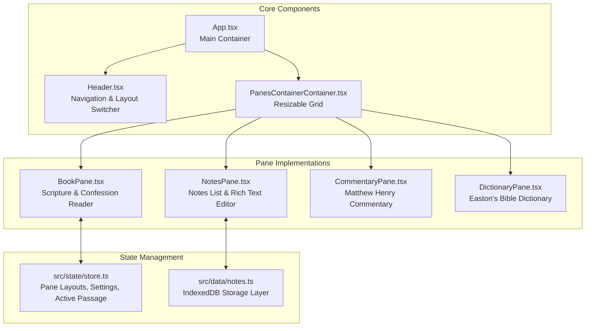

# Frontend Architecture & Web SPA (`apps/web`)

The frontend is a single-page React application located in `apps/web/`, built with Vite, TypeScript, Tailwind CSS, Zustand, and TipTap.

## Component & State Flow

## Key Modules & Directories

- `src/components/`: Core UI components (header, selectors, settings modals, footers).
- `src/panes/`: Pane layout implementations (`BookPane`, `NotesPane`, `CommentaryPane`, `DictionaryPane`).
- `src/render/`: CIR node rendering engine (`CIRRenderer.tsx`, `DocumentRenderer.tsx`).
- `src/state/`: Global Zustand store managing pane splits, current passage selection, and UI preferences.
- `src/notes/`: TipTap rich text editor integration, image compression/validation, and PDF export logic.
- `src/sync/`: Dropbox PKCE OAuth synchronization service (`dropboxSync.ts`, `merge.ts`).
- `src/i18n/`: Bilingual translation dictionary (`en.ts`, `bg.ts`).

## Code Splitting & Performance Optimization

To optimize initial page load performance, large modules are lazy-loaded on demand:
- **TipTap Editor**: Split into a lazy bundle (`RichTextEditor`) so casual readers downloading scripture bundles do not load the full rich-text editing engine.
- **Icon Libraries**: Lucide icons are tree-shaken and imported individually.
