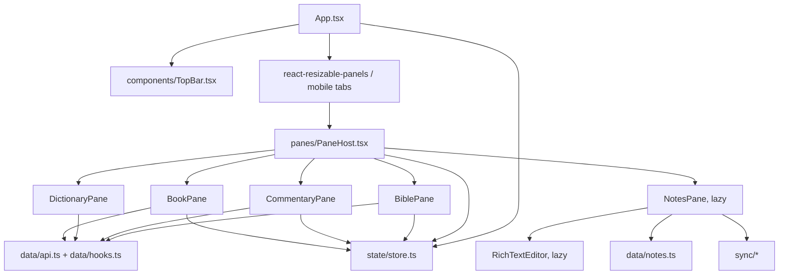

# Frontend Architecture & Web SPA (`apps/web`)

The frontend is a React 18 single-page application built with Vite, TypeScript, Zustand, plain CSS,
`react-resizable-panels`, i18next, Dexie, TipTap, and the Dropbox SDK. It does not use Tailwind or an
icon library.

## Component and state flow

## Key modules

- `src/App.tsx`: top-level panels, responsive mobile tab behavior, settings/search overlays,
  Dropbox initialization, build-update notice, and validated hash deep links.
- `src/panes/PaneHost.tsx`: routes each persisted pane record to its pane component; lazy-loads Notes.
- `src/render/CIRRenderer.tsx`: Bible verse CIR, verse layouts, poetry, headings, and words of Christ.
- `src/render/DocumentRenderer.tsx`: shared study-document CIR for commentary, dictionary, and books.
- `src/state/store.ts`: Zustand pane and reading settings state, persisted as `bible-app` in
  `localStorage`.
- `src/data/notes.ts`: Dexie schema and validated notes import/export in IndexedDB.
- `src/sync/`: Dropbox OAuth PKCE, transport, three-way merge, and sync state.
- `src/i18n/en.json`, `src/i18n/bg.json`: interface strings; `src/i18n/bookNames.ts` localizes canonical
  book names from OSIS codes.
- `src/styles/app.css`: application styles and responsive rules.
- `src/components/WorkFooter.tsx`: per-work attribution footer and source-information tabs.

## Code splitting

`PaneHost` lazy-loads `NotesPane`; `NotesPane` then lazy-loads TipTap's `RichTextEditor`. The Dropbox SDK
is imported dynamically only during authorization or file transfer. This keeps notes/editor/cloud code
off the initial reading path.

## URL state

Pane and settings state persists locally in `localStorage`. Two hash routes are shipped:

- `#/book/<workId>/<sectionId>` opens a General Book section and follows the active section as the user
  reads.
- `#/b/<workId>/<osis>/<chapter>` opens a Bible work and chapter. The app checks the work, canonical
  book, and chapter against the API before applying it; an invalid link is removed and shown as a
  visible error.

These routes are implemented in `state/deeplink.ts` without React Router. The hash is deliberately
separate from Dropbox OAuth's `?code`/`?state` callback parameters. Commentary, dictionary, exact-
verse, and complete multi-pane workspace URLs remain deferred in `plan/linking_and_embeds.md`; ordinary
pane navigation is not mirrored into a multi-pane URL yet.

## Runtime update behavior

Every Vite build emits `/version.json`. `UpdateNotice` checks it at startup, on a timer, and when the
tab regains focus. A changed build ID prompts the user to reload rather than interrupting a note edit.
Missing old lazy chunks trigger one guarded reload. Hashed assets remain immutable while HTML,
`version.json`, and `embed.js` revalidate.
