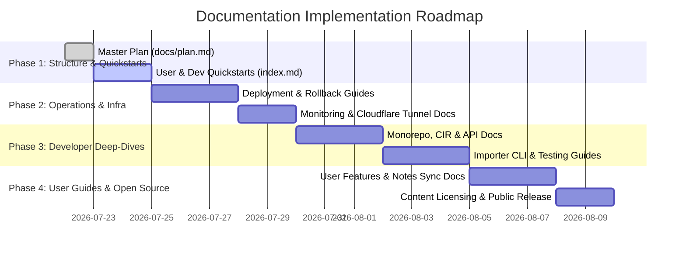

# Master Documentation Plan: `docs/` Folder

This document outlines the proposed structure, section contents, writing roadmap, and architectural considerations for the complete `docs/` documentation suite of `bible_app_bg`.

---

## 1. Executive Summary & Objectives

The `bible_app_bg` repository is a high-performance, bilingual, multi-pane Bible reader built with React + Vite (`apps/web`), FastAPI (`apps/api`), and a Python content CLI (`apps/importer`). The system is designed around a **zero-mutable-server-state** model where a single read-only SQLite + FTS5 database (`content.sqlite`) is compiled offline, and user notes live entirely client-side in the browser (IndexedDB) with optional Dropbox App Folder sync.

As the repository approaches open-source readiness (Post-M5/M6), a dedicated, comprehensive `docs/` folder is required to serve four primary audiences:
1. **End Users**: Readers utilizing the web app for Bible study, note-taking, and cross-referencing.
2. **Developers & Contributors**: Engineers developing frontend components, API endpoints, or content import adapters.
3. **System Administrators & Operators**: Operators deploying, backing up, monitoring, or self-hosting the application.
4. **Data & Content Curators**: Authors and theologians preparing source texts, versification mappings, and commentary modules.

---

## 2. Proposed Directory Structure

```text
docs/
├── plan.md                       # Master Documentation Plan (this document)
├── user/                         # User Documentation (End-User Guide)
│   ├── index.md                  # User Guide overview & quick navigation
│   ├── pane-management.md        # Resizable panes, multi-pane layouts & mobile tabs
│   ├── reading-modes.md          # Flowing vs verse-per-line, words of Christ, reader modes
│   ├── search-and-lookup.md       # Passage navigation, FTS search syntax & cross-references
│   ├── personal-notes.md         # TipTap rich text, verse anchoring, tags & PDF export
│   ├── dropbox-sync.md           # Dropbox App Folder setup, PKCE OAuth & conflict resolution
│   └── general-books.md          # General Books reader, 1689 Confession & TOC navigation
├── developer/                    # Developer Documentation (Contributor Guide)
│   ├── index.md                  # Developer overview & quickstart setup
│   ├── architecture-overview.md  # Monorepo architecture & Canonical Intermediate Representation (CIR)
│   ├── web-spa.md                # React 18, Vite, Zustand state, pane layout engine & i18n
│   ├── api-service.md            # FastAPI architecture, SQLite FTS5 queries & OpenAPI contract
│   ├── importer-cli.md           # `bibleimport` CLI, parsing USFX/OSIS/SWORD & CIR pipeline
│   ├── building-and-testing.md   # Running `scripts/check.sh`, Vitest, Pytest, Playwright E2E & axe
│   └── contributing.md           # Code style (Ruff, ESLint, Prettier), PR workflow & standards
├── deployment/                   # Deployment & Operations Documentation
│   ├── index.md                  # Production architecture overview & design principles
│   ├── hosting-options.md        # Native systemd + gunicorn vs Docker / docker-compose
│   ├── cloudflare-tunnel.md      # Cloudflare Tunnel setup, origin protection & CDN caching
│   ├── backups-and-rollback.md   # Atomic symlink swaps (SPA), SQLite snapshot/restore & zero-downtime releases
│   └── monitoring-and-alerts.md  # `/health` vs `/ready` semantics, UptimeRobot & GitHub Actions workflows
└── extra/                        # Additional Essential Documentation
    ├── content-and-licensing.md  # Content attribution, public domain sources & CrossWire licenses
    ├── security-and-privacy.md   # Local-first privacy, Content-Security-Policy (CSP) & threat model
    └── troubleshooting-faq.md    # FAQ, common build/sync errors & troubleshooting guide
```

---

## 3. Comprehensive Section Breakdown

### 3.1 User Documentation (`docs/user/`)

Target Audience: End-users reading scripture, taking notes, or using cross-references.

* **`docs/user/index.md` — User Guide Overview**
  * Introduction to the reader interface and core capabilities.
  * Key feature summary: 1–3 resizable panes, bilingual EN/BG support, zero-server tracking.

* **`docs/user/pane-management.md` — Multi-Pane Layouts**
  * Adding, removing, and resizing panes (1 to 3 side-by-side columns).
  * Pane types: Bible text, Commentary (Matthew Henry), Dictionary (Easton's), General Books (1689 Confession), and Personal Notes.
  * Mobile responsive behavior: switching between panes via mobile tabs.

* **`docs/user/reading-modes.md` — Customizing the Reading Experience**
  * Toggling between **Verse-per-Line** and **Continuous Flowing Prose** views.
  * Words of Christ styling: Off, Bold, or Red letter.
  * Paged vs Scrolling reader modes for long-form books and confessions.

* **`docs/user/search-and-lookup.md` — Search, Navigation & Cross-References**
  * Quick book/chapter navigation and verse direct links.
  * Full-Text Search (FTS) queries, scope selection (entire Bible vs testament/book).
  * TSK cross-references popovers and dictionary term lookups.

* **`docs/user/personal-notes.md` — Rich-Text Notes & Storage**
  * Creating passage-anchored notes, verse highlights, and topical notes.
  * Using the TipTap rich-text editor (headings, formatting, lists, inline links/images).
  * Exporting notes to PDF (browser print) and JSON backup/restore.
  * Recoverable deletion (trash bin and soft deletes).

* **`docs/user/dropbox-sync.md` — Notes Cloud Synchronization**
  * How notes sync works (browser-direct Dropbox App Folder sync via PKCE OAuth).
  * Step-by-step setup guide for creating a Dropbox App key.
  * Security model: zero server involvement (tokens and notes never touch `apps/api`).
  * Handling conflict copies (`notes-v1.json` conflict files).

* **`docs/user/general-books.md` — General Books & Confessions**
  * Navigating non-scriptural historical documents (e.g. 1689 Baptist Confession).
  * Table of Contents (TOC) drawer and section deep links.

---

### 3.2 Developer Documentation (`docs/developer/`)

Target Audience: Software engineers, open-source contributors, and codebase maintainers.

* **`docs/developer/index.md` — Developer Quickstart**
  * System prerequisites: Python 3.11+, Node.js 18+, `npm`, `venv`.
  * Step-by-step command sequence to set up virtualenvs, build the initial `content.sqlite`, and start local dev servers (`apps/api` on `:8080`, `apps/web` on `:5173`).

* **`docs/developer/architecture-overview.md` — Architecture & CIR Design**
  * Monorepo boundaries: `apps/web` (React SPA) ↔ `apps/api` (FastAPI) ↔ `apps/importer` (Python CLI).
  * The Canonical Intermediate Representation (CIR): abstract syntax tree for scripture, headers, poetry, and red-letter text.
  * Offline DB compilation pattern and read-only runtime model.

* **`docs/developer/web-spa.md` — Frontend Engineering (`apps/web`)**
  * Tech stack: React 18, TypeScript, Vite, Tailwind CSS / Vanilla CSS modules.
  * State management: Zustand store architecture for panes, settings, active passages, and note drawers.
  * Lazy loading strategies (TipTap rich text editor separation for fast initial bundle load).
  * Internationalization (i18n): EN/BG locale files and string key organization.

* **`docs/developer/api-service.md` — API Service Engineering (`apps/api`)**
  * Tech stack: FastAPI, Uvicorn, SQLite (`sqlite3` module with FTS5).
  * Router breakdown: `passages.py`, `search.py`, `commentary.py`, `dictionary.py`, `general_books.py`, `xrefs.py`, `works.py`, `health.py`.
  * Read-only SQLite performance tuning (`PRAGMA query_only = ON`, connection pooling, ETags & caching).
  * OpenAPI spec generation and syncing with `apps/web/src/data/api.ts`.

* **`docs/developer/importer-cli.md` — Content Importer (`apps/importer`)**
  * Tech stack: Python CLI (`bibleimport`), `click`, `pydantic`.
  * Format adapters: USFX (`usfx.py`), SWORD Bibles (`sword_bible.py`), SWORD GenBooks (`genbook.py`), and Dictionaries/Commentaries (`study.py`).
  * Content transformation pipeline: source parsing → CIR normalization → schema validation → SQLite + FTS5 indexing.
  * Strict versification alignment rules (mismatch reporting without silent renumbering).

* **`docs/developer/building-and-testing.md` — Build & Test Suite**
  * Single check entrypoint: [`scripts/check.sh`](file:///Users/hristo.trendafilov/mydev/bible_app_bg/scripts/check.sh) (Ruff lint/format, Pytest, ESLint, Prettier, Vitest).
  * End-to-end integration testing: Playwright smoke test runner [`scripts/e2e-server.sh`](file:///Users/hristo.trendafilov/mydev/bible_app_bg/scripts/e2e-server.sh).
  * Accessibility verification: `axe-core` integration in automated UI tests.

* **`docs/developer/contributing.md` — Contribution Guidelines**
  * Coding standards and formatting enforcing rules.
  * Git branching, commit message conventions, and Pull Request checklists.
  * Licensing requirements for any new content or code contributions.

---

### 3.3 Deployment & Operations Documentation (`docs/deployment/`)

Target Audience: DevOps engineers, system administrators, and self-hosters.

* **`docs/deployment/index.md` — Operations & Topology Overview**
  * High-level architectural layout: Cloudflare Edge ➔ Cloudflare Tunnel ➔ `cloudflared` daemon ➔ Gunicorn/Uvicorn (`127.0.0.1:8080`) ➔ Read-only SQLite.
  * Server state immutable design: why host migrations are as simple as copying `content.sqlite` and repointing DNS.

* **`docs/deployment/hosting-options.md` — Deployment Targets**
  * Native Systemd + Gunicorn setup on Linux VMs (current production reference).
  * Dockerized deployment: multi-stage [`deploy/Dockerfile`](file:///Users/hristo.trendafilov/mydev/bible_app_bg/deploy/Dockerfile) and [`deploy/docker-compose.yml`](file:///Users/hristo.trendafilov/mydev/bible_app_bg/deploy/docker-compose.yml).
  * Caddy reverse proxy integration snippet ([`deploy/Caddyfile.snippet`](file:///Users/hristo.trendafilov/mydev/bible_app_bg/deploy/Caddyfile.snippet)).

* **`docs/deployment/cloudflare-tunnel.md` — Cloudflare Tunnel & CDN Setup**
  * Configuring `cloudflared` for zero-open-port origin isolation.
  * Closing origin HTTP/HTTPS bypass vectors.
  * CDN caching strategy: static asset caching vs dynamic `/api/v1` pass-through with ETags.

* **`docs/deployment/backups-and-rollback.md` — Zero-Downtime Releases & Rollbacks**
  * Atomic SPA releases: versioned directories (`releases/<ts>/web_dist`), asset retention, and atomic symlink swapping via `mv -Tf`.
  * Atomic SQLite database updates: building to `content.new.sqlite` and replacing via `mv -f`.
  * Database backup automation: live online SQLite snapshot using Python `sqlite3.backup()` API.
  * Rehearsed emergency rollback procedures for SPA code, API binaries, and content DB.

* **`docs/deployment/monitoring-and-alerts.md` — Health Probes & Monitoring**
  * Probing semantics:
    * `/health` (Liveness): HTTP 200 process status check.
    * `/ready` (Readiness): HTTP 200 with DB content verification; returns HTTP 503 on missing/corrupt DB.
  * UptimeRobot 5-minute HTTP readiness monitoring configuration.
  * GitHub Actions automated uptime workflow ([`.github/workflows/uptime.yml`](file:///Users/hristo.trendafilov/mydev/bible_app_bg/.github/workflows/uptime.yml)).

---

### 3.4 Additional Worthwhile Documentation (`docs/extra/`)

During the repository review, three essential domain areas were identified that extend beyond standard user/dev/deploy guides.

* **`docs/extra/content-and-licensing.md` — Content Provenance & Legal Rights**
  * Detailed legal matrix of all texts bundled or supported:
    * **WEB, Matthew Henry, Easton's, 1689 Confession**: Public Domain.
    * **TSK Cross-References**: CC BY 4.0 (attribution details recorded).
    * **CrossWire KJV**: GPL distribution license & UK Crown copyright constraints.
    * **Bulgarian Scriptures**: Owner-provided with attested distribution rights.
  * Attribution requirements for downstream re-distributors and open-source forks.

* **`docs/extra/security-and-privacy.md` — Security & Local-First Privacy Model**
  * Zero-knowledge server architecture: why user notes, bookmarks, and search history never reach `apps/api`.
  * Content-Security-Policy (CSP) design: strict script/frame src boundaries, Dropbox endpoint scoping.
  * Untrusted input handling in `apps/importer`: XML DTD/external entity disabling, entropy check limits, shell interpolation prevention.

* **`docs/extra/troubleshooting-faq.md` — Troubleshooting & FAQ**
  * Common user issues: IndexedDB storage quota exceeded, Dropbox PKCE token re-authentication, browser cache clearing.
  * Common developer issues: Virtualenv path mismatches, Vite HMR proxy failures on port 8080, SQLite FTS index build errors.
  * Common ops issues: Cloudflare Tunnel daemon disconnects, systemd service restart loops, permission errors during symlink swaps.

---

## 4. Implementation Roadmap & Milestones

To implement this documentation suite efficiently without blocking ongoing feature work, the documentation rollout is planned in four phased sprints:



### Phase Details

1. **Phase 1: Foundation & Quickstarts**
   * Commit [`docs/plan.md`](file:///Users/hristo.trendafilov/mydev/bible_app_bg/docs/plan.md).
   * Create skeleton files for `docs/user/index.md`, `docs/developer/index.md`, and `docs/deployment/index.md`.
   * Write developer setup guide (`docs/developer/building-and-testing.md`).

2. **Phase 2: Operations & Deployment Focus**
   * Migrate and sanitize operational knowledge from [`plan/deployment/live-runbook.md`](file:///Users/hristo.trendafilov/mydev/bible_app_bg/plan/deployment/live-runbook.md) into `docs/deployment/`.
   * Document atomic release mechanics, Cloudflare Tunnel topology, and `/ready` health probe monitoring.

3. **Phase 3: Developer & Architecture Deep-Dives**
   * Document Canonical Intermediate Representation (CIR) schema and parser adapters.
   * Document FastAPI endpoints, FTS5 query patterns, and React Zustand pane layout state.

4. **Phase 4: End-User Guides & Open-Source Polish**
   * Write detailed user guides for pane splitting, reading modes, rich-text notes, and Dropbox sync setup.
   * Finalize legal & content licensing matrix (`docs/extra/content-and-licensing.md`) ahead of public repo release.
