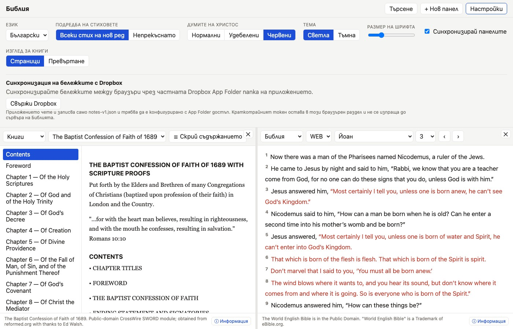

# Dropbox Cloud Synchronization

Sync your personal notes seamlessly across devices using Dropbox App Folder synchronization.

## Privacy & Security Model

> [!IMPORTANT]
> The backend server (`apps/api`) **never sees your notes, tokens, or Dropbox credentials**. Synchronization runs 100% client-side directly between your web browser and Dropbox's official API using OAuth 2.0 PKCE.

## Setup Instructions

1. **Create a Dropbox App Key**:
   - Go to the [Dropbox App Console](https://www.dropbox.com/developers/apps).
   - Create an app with **Scoped Access** and **App Folder** access (do not choose Full Dropbox).
   - Enable `files.content.read` and `files.content.write` permissions.
   - Register your app domain (e.g. `https://bible.trendafilovi.net/` or `http://localhost:5173/`).
2. **Connect in App**:
   - Open **Settings ➔ Dropbox Sync**.
   - Paste your public **App Key** and click **Connect Dropbox**.
   - Authenticate via Dropbox OAuth.

## Conflict Resolution

If notes are edited simultaneously on two devices, the app automatically creates an explicit conflict copy (e.g., `notes-v1 (Conflict Copy 2026-07-22).json`) inside your Dropbox App Folder so no data is ever overwritten or lost.
