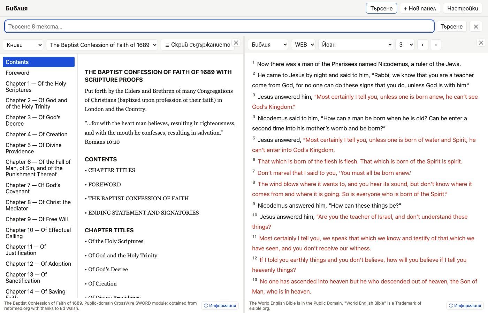

# General Books & Historical Confessions

In addition to scripture, the app provides a reader pane for non-scriptural historical documents, confessions of faith, and theological works.

## Available Works

- **1689 London Baptist Confession of Faith**: A historic summary of reformed Baptist theology, formatted with chapter hierarchy and scripture proof texts.

## Reader Navigation

- **Table of Contents Drawer**: Use the left sidebar drawer to browse chapters and sections.
- **Scripture Proof-Text Popups**: Hover or click on inline scripture citations (e.g. `[2 Tim. 3:15-17]`) to open scripture previews in an instant popup window.
- **Paged / Scrolling Options**: Read continuously or flip page-by-page.
