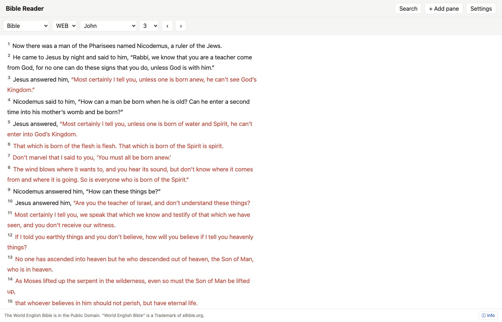

# User Guide: Overview & Quick Start

Welcome to **DidacheDynamis**, a high-performance, bilingual, multi-pane Bible study reader.

## Key Features

- **Multi-Pane Layout**: Study up to 3 side-by-side columns (Bible, Commentary, Dictionary, Notes, General Books).
- **Multiple Translations & Sources**: World English Bible (WEB), King James Version (KJV), Matthew Henry Commentary, Easton's Bible Dictionary, and historic Confessions (1689 London Baptist Confession).
- **Personal Notes**: Client-side rich-text editor (TipTap) saved locally in your browser (IndexedDB).
- **Dropbox Cloud Sync**: Optional direct browser-to-Dropbox App Folder synchronization with PKCE security.
- **Reading Customizations**: Verse-per-line vs. flowing prose, Words of Christ styling (off, bold, red), and paged vs. scrolling reader modes.
- **Bilingual Interface**: Full support for English and Bulgarian UI text.
- **Unified Search Workspace**: Search Bible, commentary, dictionary, and books with source,
  testament, and book filters, refinement, ordering, history, and complete paginated results.
- **Source Information**: Every content pane ends with an Info control for edition, license,
  attribution, publisher/source, and (where applicable) the Bible book list.
- **Local Notes**: The Bible API has no accounts or notes tables; personal notes stay in the browser
  unless you explicitly enable direct Dropbox sync.

## Quick Start Guide

1. **Navigating Passages**: Click the book selector at the top left to pick any book and chapter (e.g. *John 3*).
2. **Opening Panes**: Click **+ Add pane** on the top right to add a 2nd or 3rd pane.
3. **Changing Pane Work**: In any pane header, click the dropdown to switch between *Bible*, *Commentary*, *Dictionary*, *Notes*, or *General Books*.
4. **Taking Notes**: Open a *Notes* pane or click a verse number to attach a personal study note.

---

## User Guide Topics

- [Pane Management](pane-management.md) — Multi-pane layouts & mobile tabs
- [Reading Modes](reading-modes.md) — Verse-per-line, flowing prose, and red-letter text
- [Search & Lookup](search-and-lookup.md) — Unified search, history, passage navigation & cross-references
- [Personal Notes](personal-notes.md) — Rich text, verse anchoring & PDF export
- [Dropbox Sync](dropbox-sync.md) — App Folder sync and explicit note conflict copies
- [General Books](general-books.md) — Reading historic confessions & documents
- [Embedding Scripture Pop-ups](embedding-scripture.md) — Add `embed.js` reference pop-ups to your own site
