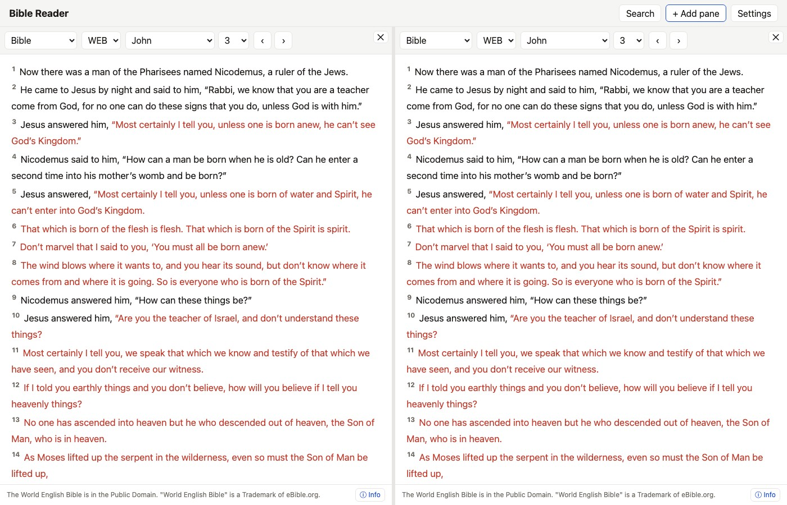

# Pane Management Guide

The reader supports 1 to 3 side-by-side resizable panes, allowing deep parallel study of scripture, commentaries, dictionaries, confessions, and personal notes.

> [!NOTE]
> On desktop displays, splitters between panes can be dragged horizontally to adjust column widths. On mobile screens, panes stack into easy-to-use navigation tabs.

## Managing Panes

### Adding & Removing Panes
- **Adding a pane**: Click **+ New pane** in the top bar. Repeat to open up to three panes.
- **Closing a Pane**: Click the **X** button on the right side of any pane header to remove that specific column.

### Changing Content Types
Each pane operates independently. Click the selector in the top-left of a pane header to choose its content type:

| Content Type | Description |
|---|---|
| **Bible** | Scripture text (WEB, KJV) with verse numbers and cross-references |
| **Commentary** | Verse-by-verse commentary (Matthew Henry) synced to active scripture |
| **Dictionary** | Biblical dictionary lookup tool (Easton's Bible Dictionary) |
| **Notes** | Personal rich-text notes editor (TipTap) saved locally |
| **General Books** | Imported historic documents; currently the 1689 Baptist Confession |

### Synchronized Navigation
When **Sync panes** is enabled in Settings, choosing a Bible book/chapter or using the previous/next
chapter buttons updates all open Bible and Commentary panes to that reference. Scrolling position is
not synchronized.
