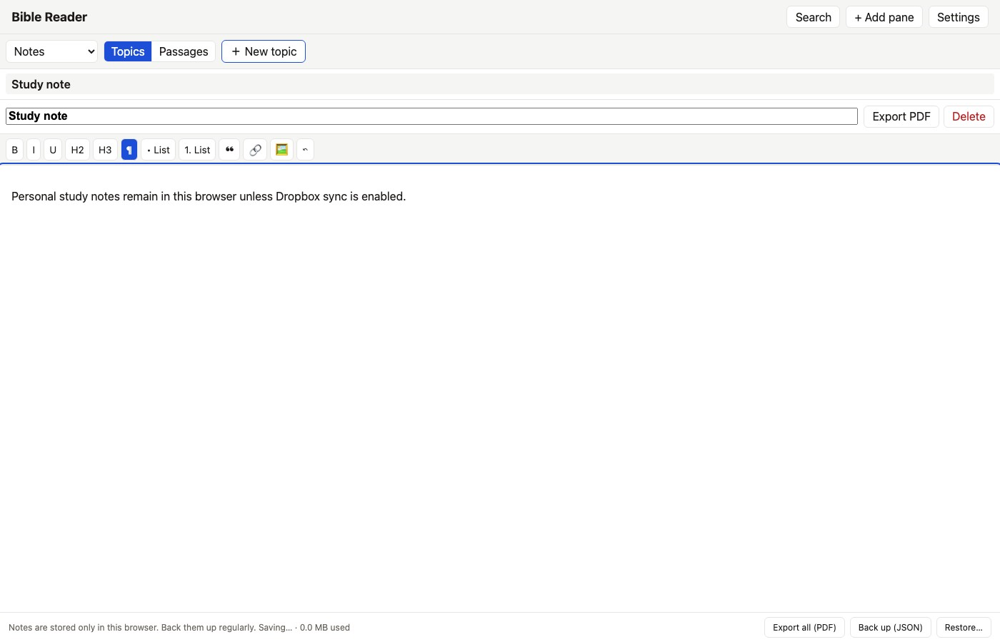

# Personal Notes & Rich Text Editor

Personal study notes are stored locally in **IndexedDB** and are never sent to the Bible API. If you
enable Dropbox sync, the browser sends the notes directly to this app's private Dropbox App Folder.

## Features & Capabilities

- **Rich Text Editing**: Powered by TipTap, supporting bold, italics, underline, H2/H3 headings,
  paragraphs, quotations, bullet and numbered lists, links, and inline images.
- **Passage Anchoring**: Create a note for the current chapter, or click a Bible verse number and use
  **Add note for verse** to attach one to that verse. Selecting it navigates an open Bible pane.
- **Topical Notes**: Create freely titled topic notes. Tags are not implemented yet.
- **PDF Export**: Print or export notes directly to formatted PDF files using browser print styling.
- **JSON Backup & Restore**: Export your entire note database to JSON for safe-keeping, or import notes onto a new device.
- **Recoverable Deletion**: Deletion is soft and an **Undo delete** action is offered for the most
  recently deleted note. There is currently no Trash browser or permanent-purge control.
