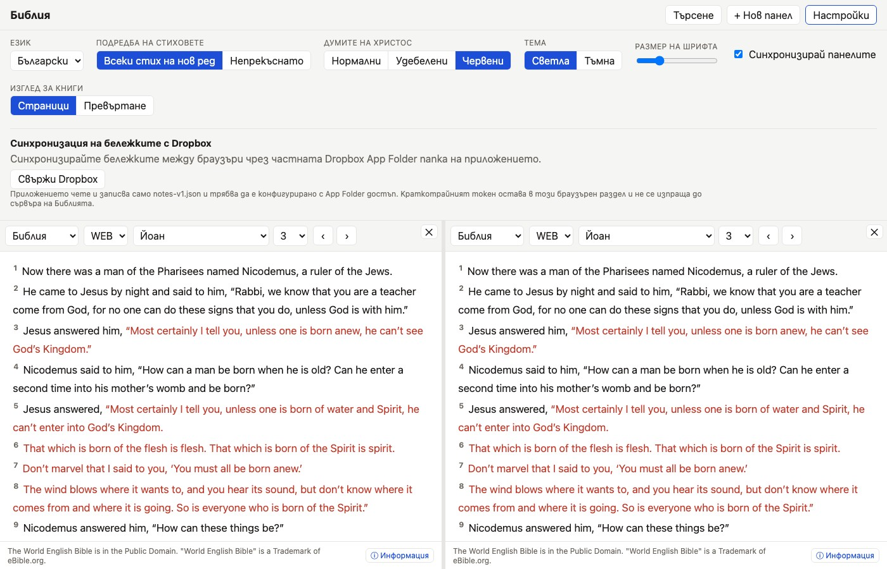

# Reading Modes & Typography Customization

Customizing typography and presentation improves readability during scripture study and devotional reading.

## Text Layout Options

Open the **Reading Settings** menu from the top navigation bar to configure layout preferences:

### 1. Verse-per-Line vs. Flowing Prose
- **Verse-per-Line**: Displays each verse on a new line with prominent verse numbers. Ideal for line-by-line verse analysis and study.
- **Flowing Prose**: Renders text in continuous paragraph format, preserving original literary structure and narrative flow.

### 2. Words of Christ Styling
The application supports special formatting for the spoken words of Jesus Christ in the Gospels and New Testament:
- **Off**: Standard text rendering without special color.
- **Bold**: Highlighting spoken words with bold weight.
- **Red**: Classic red-letter Bible text presentation.

### 3. Paged vs. Scrolling Reader Mode
For long-form reading (such as General Books or lengthy chapters), you can toggle between continuous vertical scrolling or clean horizontal paged view.
