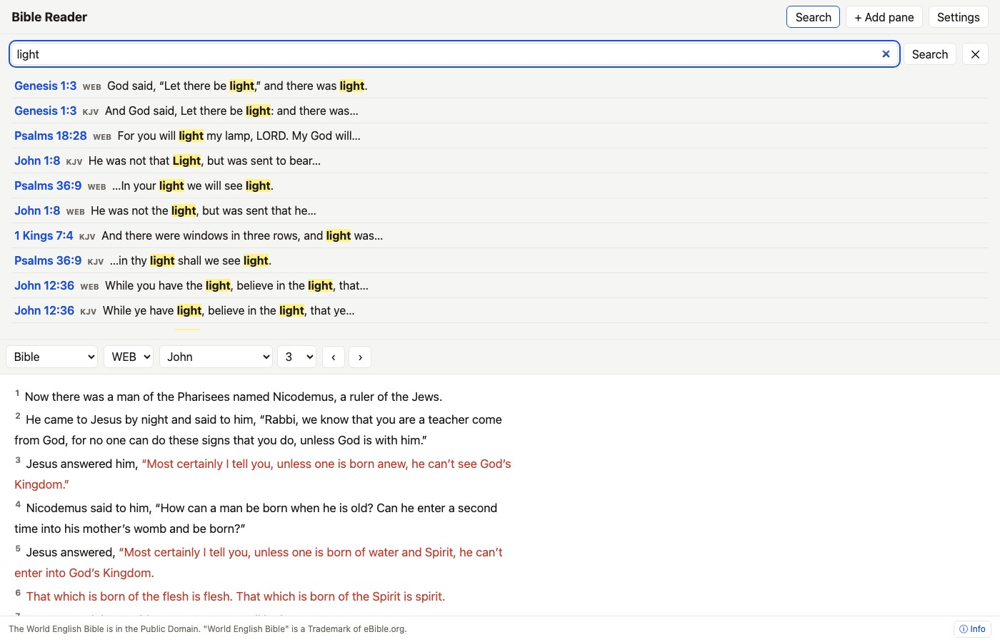

# Search, Navigation & Cross-References

The app provides fast passage lookup, high-speed Full-Text Search (FTS5), and Treasury of Scripture Knowledge (TSK) cross-references.

## Quick Passage Navigation

- **Book & Chapter Selectors**: Use the two selectors in a Bible or Commentary pane header to open a
  chapter (for example, *Genesis 1* or *Matthew 5*).
- **Previous / Next Chapter**: Use the arrow buttons beside the chapter selector. They also cross book
  boundaries. There are currently no chapter keyboard shortcuts or direct verse-range selector.

## Full-Text Search (FTS)

Open **Search** from the top bar, enter one or more words, and submit the form. Search matches Bible
verses containing all normalized words and returns highlighted snippets from the installed Bible
works. Clicking a result opens its chapter and translation. Search scopes and phrase-sensitive quoted
queries are not available yet.

## Cross-References & Dictionary Lookups

- **Cross-References**: Click a verse number to open its TSK-derived references with inline WEB/KJV
  previews; click a result to navigate there.
- **Easton's Dictionary**: Open a Dictionary pane, filter the headword list, and select an entry.
  Automatic lookup from highlighted Bible words is not implemented.
