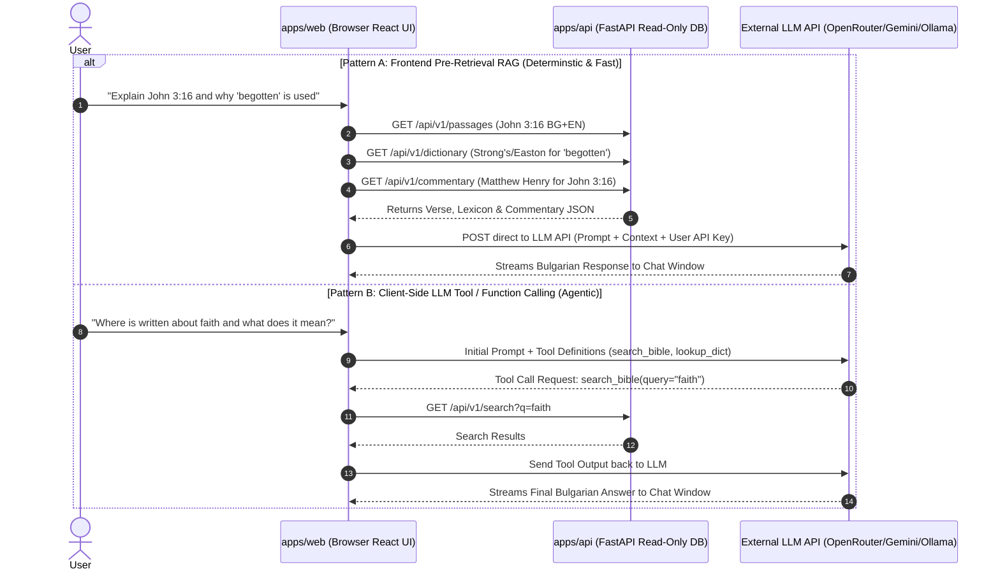

# Interactive AI Chat Window — 2026 Model Benchmarks, Cost Analysis, BYOK & Tool-Calling Architecture

## 1. Executive Summary

This report provides a complete architectural proposal, provider price comparison, and client-side implementation strategy for adding an **Interactive AI Chat Window** to the bilingual Bible study application (`bible_app_bg`).

The chat assistant answers user queries in Bulgarian and English, such as:
- *"Explain me this verse"* (Exegesis & Context)
- *"Explain me why this word is used here, and not a synonym"* (Lexical / Morphological Nuance)
- *"Make me a plan of this book/chapter"* (Outlining & Structure)
- *"Summarize this Book/Verse/Chapter"* (Abstractive Summarization)
- *"Where in the book is written about X?"* (Topical RAG Retrieval)

---

## 2. Hosted Qwen API Providers & Price Comparison

If hosting a local model on hardware isn't desired, external API providers offer **Qwen 3 / 3.5 / 2.5** models with **free tiers** or **dirt-cheap pay-as-you-go pricing**:

| Provider | Model Tag / Variant | Free Tier Availability | Paid Cost per 1M Tokens | Best Use Case |
| :--- | :--- | :--- | :--- | :--- |
| **OpenRouter** | `qwen/qwen-2.5-72b:free`<br>`qwen/qwen3:free` | ✅ **100% Free** (Tagged `:free`) | ~$0.05 – $0.15 / 1M tokens | Best for zero-cost testing & BYOK |
| **Alibaba Cloud** *(DashScope)* | `Qwen-Turbo`<br>`Qwen-Plus` | ✅ **1M – 10M Free Tokens** for new accounts | ~$0.05 – $0.20 / 1M tokens | Direct official Qwen API |
| **DeepInfra** | `qwen/Qwen2.5-72B` | ⚠️ $1–$5 starter credit | **~$0.07 / 1M tokens** | Lowest paid rate ("Budget Champion") |
| **Together AI / Fireworks** | `qwen-2.5-72b-instruct` | ✅ **$5 – $25 Free Credits** upon sign-up | ~$0.10 – $0.20 / 1M tokens | High-speed serverless inference |
| **Google AI Studio** | `gemini-3.6-flash` | ✅ **15 RPM / 1,500 RPD Free** (~45k chats/mo) | ~$1.50 input / $7.50 output | Primary default cloud model |

---

## 3. Financial Cost Analysis: Free Provisioning vs User Subscriptions (BYOK)

### Developer-Funded Free Access
* Average query size: ~1,500 tokens context + ~500 tokens response = ~2,000 tokens per chat turn.
* **Cost per query (Gemini 3.6 Flash / OpenRouter Qwen)**: **~$0.001 to $0.006 (0.1 - 0.6 cents)**.
* **Monthly Cost for 100 active users (1,000 chats/mo)**: **~$1.00 – $6.00 / month**.
* **Zero-Cost Strategy**: Utilizing Google AI Studio Free Tier or OpenRouter `:free` models lets you provide **45,000 chats/month completely free of charge**.

---

## 4. Client-Side BYOK Architecture: How the Browser Accesses Backend Resources

When the user enters their own API key (BYOK) in the browser (`apps/web`), the chat runs **entirely client-side** so user API keys are never stored on your server.

To give the LLM access to Bible text, dictionaries, commentaries, and search indexes in `content.sqlite`, we have **two clean architectural patterns**:



---

### Pattern A: Frontend Pre-Retrieval RAG (Recommended Default)

1. User submits a question in the React Chat Drawer.
2. `apps/web` examines the active context (e.g. currently opened Bible passage, chapter, or active note).
3. `apps/web` fires fast parallel REST calls to existing FastAPI endpoints:
   - `GET /api/v1/passages?reference=John+3:16`
   - `GET /api/v1/commentary?reference=John+3:16`
   - `GET /api/v1/dictionary?term=begotten`
4. React compiles these responses into a structured Bulgarian system prompt.
5. React makes a direct `fetch()` call to the user's selected LLM provider (Gemini, OpenRouter, Anthropic, or local `http://localhost:11434/api/generate`) using their stored key.

* **Pros**: 1 HTTP call to local API + 1 streaming call to LLM. Extremely fast, deterministic, lowest token cost.

---

### Pattern B: Client-Side LLM Tool / Function Calling

For open-ended questions (*"Find all places discussing faith, look up Easton's dictionary, and summarize"*), React registers JavaScript functions as LLM Tools:

```typescript
// Client-side tool definitions provided to OpenRouter / Gemini SDK
const chatTools = [
  {
    name: 'search_bible',
    description: 'Searches the Bible, commentaries, and books for keywords',
    parameters: { type: 'object', properties: { query: { type: 'string' } } }
  },
  {
    name: 'get_passage',
    description: 'Fetches specific verses in Bulgarian and English',
    parameters: { type: 'object', properties: { reference: { type: 'string' } } }
  },
  {
    name: 'lookup_dictionary',
    description: 'Looks up theological dictionary terms',
    parameters: { type: 'object', properties: { word: { type: 'string' } } }
  }
];
```

When the LLM decides it needs data, it returns a tool call request. React executes the local fetch to `apps/api`, feeds the result back to the LLM, and the LLM streams the answer to the user.

* **Pros**: Highly flexible for complex multi-step study workflows.

---

## 5. Security & Privacy Guarantees

1. **User Key Isolation**: API keys entered by the user in `apps/web` are saved in the browser's `IndexedDB` / `localStorage` only.
2. **Read-Only API Compliance**: Tool calls and pre-retrieval calls only access read-only GET endpoints (`/api/v1/*`), upholding the core `AGENTS.md` constraint.
3. **Zero Server State**: The FastAPI server remains 100% stateless and read-only.
