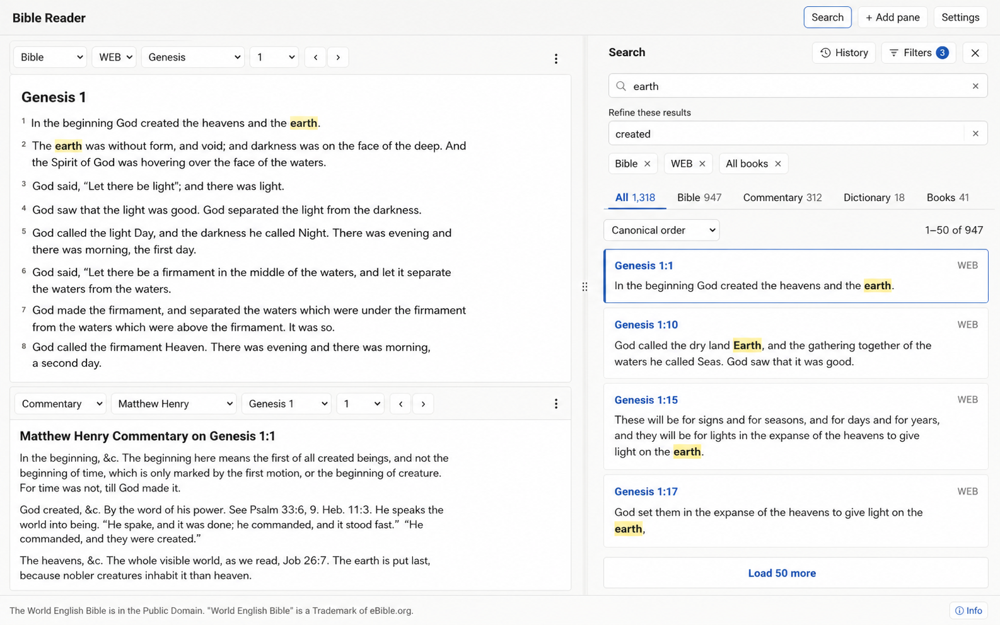
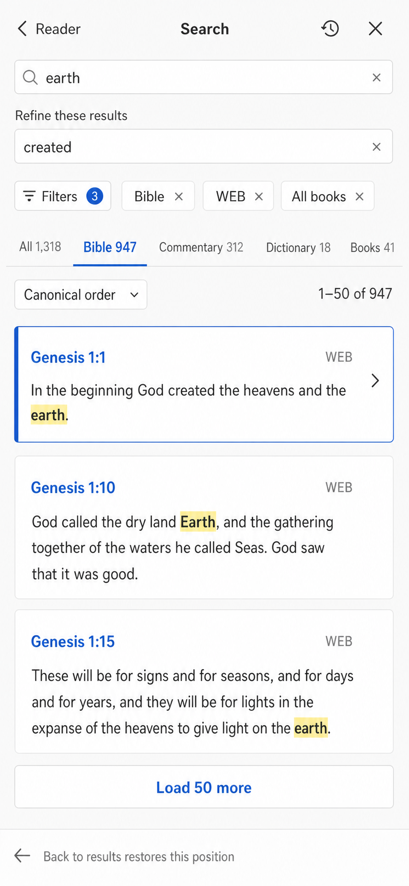

# M7 Search Workspace and M8 Strong's Search

Status: **M7.1–M7.3 delivered; M7.4 in progress; M8 proposed**
Last reviewed: 2026-07-25

This document records the delivered unified search foundation/workspace and proposes its remaining
filtering, history/refinement, and Strong's extensions. M7.1/M7.2 expose commentary, dictionary, and
General Book indexes, true totals, stable 50-result pagination, type tabs/counts, work/testament
filters, and relevance/canonical ordering. M7.3 delivers the persistent docked/full-screen workspace.
The first M7.4 slice adds the granular book picker, filter chips, and mobile filter sheet; history and
the refine field remain.

See also:

- [`frontend/frontend_design.md`](frontend/frontend_design.md)
- [`backend/backend_design.md`](backend/backend_design.md)
- [`general_books.md`](general_books.md)
- [`content_and_licensing.md`](content_and_licensing.md)

## 1. Why search needs a redesign

The original UI sent separate Bible/General Book requests, capped apparent results at 20, and did not
query commentary/dictionary FTS. M7.1/M7.2 fixed that correctness foundation. The remaining redesign
is about a persistent workflow, finer scopes, history, refinement, and future lexical search.

The redesign must provide:

1. Bible, commentary, dictionary, and General Book search.
2. Filters by content type, individual work/translation, testament, and Bible book.
3. Local search history and saved searches.
4. Server-side refinement within the complete result set.
5. True result totals and stable pagination.
6. Relevance and canonical/source ordering.
7. A clean future path for Strong's numbers, lemmas, and morphology.

## 2. Product decision: a Search Workspace

Search should be a **persistent tool workspace**, not an ordinary content pane and not the current
temporary overlay.

### Desktop

- Open a resizable drawer docked to the right of the 1–3 reading panes.
- Do not consume one of the three reading-pane slots.
- Keep the query, filters, loaded pages, selection, and scroll position while reading results.
- Clicking a result opens or reuses the correct Bible, commentary, dictionary, or book pane without
  closing the drawer.
- Allow collapsing the workspace to a narrow Search button and restoring it unchanged.

Concept mockup:



### Mobile

- Present Search as a full-screen view rather than a cramped drawer.
- Filters open in a bottom sheet.
- Opening a result switches to its reader pane.
- A clear **Back to results** action restores the complete search state and scroll position.

Concept mockup:



The mockups communicate information hierarchy and interaction, not final typography, colors, icons,
or exact copy. Implementation should continue using the application's existing tokens and controls.

## 3. Search controls

The sticky header contains:

- Primary query input.
- Search/submit button.
- Search-history button.
- Filters button with an active-filter count.
- Close/collapse action.

After the first successful query, show a second field named **Refine these results**. Its terms are
combined with the original query using `AND`. Refinement must run on the server against the complete
matching corpus; filtering only the hits currently loaded in the browser would produce incorrect
results.

Active refinements and filters appear as individually removable chips. Include a **Clear filters**
action that retains the query, and a separate **Clear search** action.

## 4. Scope model

Filters are hierarchical so the common cases remain quick while advanced choices stay available.

### 4.1 Content type

- Bible
- Commentary
- Dictionary
- Books
- Strong's (M8, displayed only when indexed lexical works exist)

### 4.2 Work/source

Populate the list from `/api/v1/works`; never hard-code installed source IDs in React. Examples for
the present data set are WEB, KJV, Matthew Henry, Easton's, and the 1689 Baptist Confession.

The user can select one or several works. Selecting a content type limits the work list to compatible
works. A one-click **Current source** scope should use the active reader pane's work.

### 4.3 Canonical range

Applicable to Bible verses and reference-bound commentary:

- Entire Bible
- Old Testament
- New Testament
- Selected books
- Current book

The importer already defines the current Protestant 66-book canonical order. Add explicit canon-group
metadata there and carry it into the database/API instead of repeating an `order <= 39` rule in the
frontend. Supporting another canon later requires an explicit canon profile and is a separate product
decision.

Canonical filters do not silently apply to dictionary or General Book documents. When a user chooses
one while incompatible content types are selected, the UI must explain which groups it affects or
offer to restrict the search to Bible and commentary.

### 4.4 Language

The API accepts `languages=`, but the UI deliberately does not expose it while every installed content
work is English. Add the control only after licensed Bulgarian/multilingual content is installed.

## 5. Results experience

### 5.1 Groups and counts

Show content tabs/counts such as:

```text
All 1,318 | Bible 947 | Commentary 312 | Dictionary 18 | Books 41
```

The **All** view shows a small initial selection from each group. It does not interleave raw BM25
scores from short Bible verses and long commentary documents because those scores are not directly
comparable. Selecting one group switches to its full paginated result list.

Each result includes:

- Content-type icon and accessible text label.
- Canonical reference, dictionary headword, or General Book breadcrumb.
- Work abbreviation.
- Highlighted and safely rendered excerpt.
- An action appropriate to the result type.

| Result kind | Navigation |
|---|---|
| Bible verse | Open/reuse a Bible pane at the exact verse and translation |
| Commentary entry | Open/reuse a commentary pane at its canonical reference |
| Dictionary entry | Open/reuse a dictionary pane at its headword |
| General Book section | Open/reuse a book pane at its section |
| Strong's occurrence | Open an annotated Bible pane and lexical details |

If several panes are compatible targets, use the active compatible pane first. A result overflow menu
may offer **Open in pane…**; ordinary clicks should remain one-step actions.

### 5.2 Complete results and pagination

Complete search means every match is reachable, not that thousands of rows are placed in the DOM.

- Fetch 50 hits for the selected group initially.
- Display `1–50 of 947` and a clear **Load 50 more** action.
- Return `total`, `offset`, `limit`, and `has_more` from the API. `total` is a second full `MATCH`
  count per group (FTS5 has no free total); cheap at this corpus size (~31k verses, smaller study
  sets), but a conscious cost — and it participates in the existing ETag/Cloudflare caching.
- Use deterministic secondary sort keys so consecutive pages never duplicate or omit hits.
- Preserve loaded pages and scroll position while opening a result.
- Consider list virtualization only after measuring; it is not required for the first 50–200 rows.

### 5.3 Ordering

Offer two top-level choices:

- **Relevance** — FTS5 `bm25()` within each result type, with a stable locator tie-breaker.
- **Source order** — the natural order for the selected result type.

Source order means:

| Type | Order |
|---|---|
| Bible | Canonical book, chapter, verse, work |
| Commentary | Canonical book, chapter, verse range, entry ID |
| Dictionary | Headword alphabetically |
| General Book | Work and hierarchical section order |

In the All view, results remain grouped by type and the selected order applies within each group.
Dictionary headwords and General Book section titles should carry more relevance weight than body
text.

### 5.4 Schema prerequisites for ordering, pagination, and weighting

**Delivered in M7.1/M7.2.** The details below explain why that release required one importer/schema
revision and full content rebuild; they are no longer outstanding prerequisites.

Canonical ordering and stable pagination are **not** a pure API/UI change — they require importer and
schema work, because the current FTS tables cannot support them as built:

- **Bible canonical order needs sortable numeric columns.** `bible_fts` stores the locator as a single
  string column (`ref UNINDEXED`), and it is a standalone contentless table, so there is no rowid join
  back to `verses`. A string `ref` cannot be ordered canonically in SQL (`Gen.1.10` sorts before
  `Gen.1.2`, and there is no book order). Add `book_order`, `chapter`, and `verse` as `UNINDEXED`
  columns to `bible_fts` (or rebuild it as an external-content FTS over `verses`) so the provider can
  `ORDER BY book_order, chapter, verse, work_id` with `LIMIT/OFFSET`. This is the sort key that also
  makes pagination deterministic.
- **Weighted headword/title needs indexed columns.** `dictionary_fts.headword` and
  `book_fts.section_id` are `UNINDEXED` (locators, not searchable), and `dictionary_fts.text` is only
  the entry body. So today a term that appears only in a headword or a section title cannot match, and
  `bm25()` cannot up-weight it. Fold the headword/title into an indexed FTS column (or add a dedicated
  indexed column) so both matching and `bm25()` column weighting work.
- **Commentary needs a stable entry ID.** `commentary_entries` has no primary key; the `commentary_fts`
  locator is `osis.chapter[.verse_start]`, which is not guaranteed unique. Add a stable `entry_id` to
  the table and carry it in the FTS locator so navigation is unambiguous and pagination cannot drift
  when two entries share a reference.

All three ride a **single `content.sqlite` rebuild** through the importer — batch them into one schema
revision and one rebuild/redeploy rather than three. Production stays read-only; nothing here changes
the runtime's read path other than the columns it can order and filter by.

## 6. Search history

Search history remains local to the browser in a separate, versioned `localStorage` record such as
`bible-search-v1`.

- Keep the most recent 50 distinct searches.
- Store the query, refinements, scopes, ordering, and timestamp.
- Deduplicate identical effective searches and move a repeated search to the top.
- Allow rerun, pin/save, delete one, and clear all.
- Show recent and pinned searches when the main input is empty.
- Do not include history in Dropbox note synchronization in M7. Search activity is separate,
  potentially sensitive data and needs an explicit future opt-in before cross-device syncing.

The application may log normal API request URLs at the proxy/origin today. Privacy documentation
should continue to avoid implying that search queries are local-only.

## 7. Unified public API

Replace the frontend's separate Bible and General Book calls with one query contract:

```http
GET /api/v1/search
    ?q=earth
    &refine=created
    &types=bible,commentary
    &works=web,mhc
    &canon=nt
    &books=John,Rom
    &languages=en
    &sort=canonical
    &limit=50
    &offset=0
```

`refine=` in this example is **aspirational M7.4** and is not accepted by the shipped endpoint.
The other shown filter/order/pagination parameters are implemented.

Comma-separated values match the current `works` convention. Validate every enum/identifier and cap
query, refinement, list, limit, and offset sizes. All SQL values remain parameterized; the FTS query
builder continues quoting normalized tokens rather than accepting arbitrary FTS syntax.

Suggested response:

```json
{
  "query": "earth",
  "refine": "created",
  "sort": "canonical",
  "total": 42,
  "groups": [
    {
      "type": "bible",
      "total": 31,
      "offset": 0,
      "limit": 50,
      "has_more": false,
      "hits": []
    },
    {
      "type": "commentary",
      "total": 11,
      "offset": 0,
      "limit": 50,
      "has_more": false,
      "hits": []
    }
  ]
}
```

Each hit is a discriminated union with common fields (`kind`, `work_id`, `title`, `snippet`) and a
typed locator for a verse, commentary entry, headword, or section. Initial All queries can return a
small per-group preview; loading more requests one `types=` value and paginates that group.

M7.1 shipped the grouped envelope with a Bible group; M7.2 added commentary, dictionary, and books
without breaking the TypeScript contract. The old flat response and separate `/search/books` client
path are no longer the application contract.

## 8. Backend search providers

Keep the source-specific FTS tables and place a normalized provider layer above them:

```text
SearchService
├── BibleSearchProvider          -> bible_fts
├── CommentarySearchProvider     -> commentary_fts
├── DictionarySearchProvider     -> dictionary_fts
├── GeneralBookSearchProvider    -> book_fts
└── StrongsSearchProvider        -> verse_tokens / strong_lexicon (M8)
```

Each provider implements count, facet, page, and hit-normalization operations for the filters it
supports. This avoids pretending that heterogeneous documents have identical ranking semantics and
provides a clean Strong's extension without moving format-specific logic into the API.

Required importer/schema work (all of it rides one `content.sqlite` rebuild — see §5.4):

1. Add sortable `book_order`/`chapter`/`verse` columns to `bible_fts` (or make it external-content over
   `verses`) so canonical order and deterministic pagination are possible in SQL (§5.4).
2. Give commentary entries a stable `entry_id` and include it in `commentary_fts` locators (§5.4).
3. Index dictionary headwords as weighted searchable text as well as entry bodies (§5.4).
4. Index General Book titles/breadcrumbs as weighted text as well as section bodies (§5.4).
5. Add explicit canon-group (testament) metadata to the canonical book definition (`books.py` today has
   `usfm/osis/order/name_en` only) and carry it into database-facing metadata, instead of an
   `order <= 39` rule in the frontend.
6. Rebuild `content.sqlite` offline through the importer; production remains read-only.

Tokenizer note: all FTS tables use `unicode61 remove_diacritics 2`, which is correct for English but
lossy for Greek/Hebrew accents and Hebrew niqqud. This does not affect M8 lexical search — Strong's
lemma/transliteration search runs against the structured `strong_lexicon`/`verse_tokens` tables (§10),
not FTS — but revisit the tokenizer when the Bulgarian Bible and any Greek/Hebrew display text land.

## 9. Frontend state and navigation

Create a dedicated search store or slice rather than putting transient results into pane state:

```ts
interface SearchState {
  open: boolean;
  mode: "docked" | "fullscreen";
  query: string;
  refinements: string[];
  scope: SearchScope;
  sort: "relevance" | "canonical";
  selectedGroup: SearchKind | "all";
  groups: SearchGroupState[];
  selectedHitId: string | null;
  scrollOffsets: Record<string, number>;
}
```

Persist history and pinned searches, but keep current results in memory. A content-version change
invalidates result pages while preserving harmless query/history state. Add generic navigation actions
such as `openSearchHit(hit, preferredPaneId?)` rather than embedding pane-selection rules inside the
Search component.

## 10. M8 Strong's-ready design

Strong's is structured lexical data and must not be inserted as ordinary free text into `bible_fts`.
Introduce it only after selecting sources whose licenses permit import, redistribution, and public web
display.

Proposed data model:

```sql
CREATE TABLE verse_tokens (
    work_id     TEXT NOT NULL,
    osis_code   TEXT NOT NULL,
    chapter     INTEGER NOT NULL,
    verse       INTEGER NOT NULL,
    position    INTEGER NOT NULL,
    surface     TEXT NOT NULL,
    normalized  TEXT NOT NULL,
    strong_id   TEXT,
    morphology  TEXT,
    PRIMARY KEY (work_id, osis_code, chapter, verse, position)
);

CREATE INDEX idx_verse_tokens_strong
    ON verse_tokens(strong_id, work_id, osis_code, chapter, verse);

CREATE TABLE strong_lexicon (
    strong_id       TEXT PRIMARY KEY,
    language        TEXT NOT NULL,
    lemma           TEXT NOT NULL,
    transliteration TEXT,
    pronunciation   TEXT,
    definition_json TEXT NOT NULL
);
```

Normalize identifiers as `H0001` and `G0001`. Future search can support:

- Exact Strong number.
- Hebrew/Greek lemma.
- Transliteration.
- English gloss.
- Morphology, if the chosen source provides it with compatible rights.
- Combined text and lexical constraints, for example `earth` within verses tagged `G1093`.

The current SWORD Bible adapter reduces verse fragments to display text plus words-of-Jesus flags. To
support Strong's, it must preserve word-level OSIS `<w lemma="strong:…">` and morphology attributes in
the canonical representation while also populating `verse_tokens`. The reader then highlights the
translated surface word and opens the lexicon entry. The runtime still reads imported SQLite data; it
does not parse SWORD modules directly.

## 11. Delivery milestones

### M7.1 — Correctness and completeness (Bible) — DELIVERED 2026-07-23

Includes the one schema change Bible ordering depends on — it is **not** an API/UI-only step (§5.4).
Shipped: `bible_fts` sort columns + importer, grouped `/search` envelope with `total`/`has_more`,
`sort=relevance|canonical` with a stable canonical tie-breaker, 50-result pages, and the overlay UI's
count + Load more + sort toggle (EN/BG). Requires a `content.sqlite` rebuild before deploy (the API now
orders by the new columns). Regression tests cover canonical order and pagination completeness.

- Add sortable `book_order`/`chapter`/`verse` columns to `bible_fts` and rebuild `content.sqlite`.
- Introduce the **final grouped `/search` envelope** (§7) with a single `bible` group carrying `total`,
  `offset`, `limit`, and `has_more` — do not ship an interim flat shape.
- Add relevance and canonical ordering for Bible, with a stable locator tie-breaker so pages never
  duplicate or omit hits.
- 50-result pages; show `1–50 of N` and Load more in the current overlay UI.
- Migrate `apps/web/src/data/api.ts` and `SearchPanel` to the grouped envelope.
- Make Genesis 1:1 reachable for `earth`; add regression tests for canonical ordering and
  pagination stability (no duplicate/omitted hits across pages).

### M7.2 — Unified cross-content engine — DELIVERED 2026-07-23

Requires a `content.sqlite` rebuild (batched schema changes, §5.4/§8). Shipped:

- Batched schema/importer changes in one rebuild: commentary `entry_id`; indexed+weighted dictionary
  `headword_text` and book `title_text`; `osis`/`testament`/`book_order` on `bible_fts` and
  `commentary_fts`; `testament` canon-group metadata from `books.py` (`OT_MAX_ORDER`).
- Provider layer (`app/search_providers.py`): Bible/Commentary/Dictionary/GeneralBook providers with
  count + page + hit normalization; `bm25()` weights the headword/title columns above body.
- Unified `/search` returns `groups[]` for all four types (multi-type = per-group preview; single
  `types=` = paginated). Filters: `types`, `works`, `canon` (testament), `books`, `languages`.
- `/search/books` retired; the web client uses the unified endpoint with group tabs/counts, testament
  + sort + source filters, per-type navigation (`openPassage`/`openCommentary`/`openDictionary`/
  `openBookSection`), and Load-more pagination. EN/BG strings added.
- Deferred after M7.2: the full docked/full-screen UI to M7.3 and the granular book picker to M7.4
  (the API already accepts `books=`).

### M7.3 — Search Workspace UI — DELIVERED 2026-07-25

Shipped:
- The overlay is replaced by a **Search Workspace** (`components/SearchDrawer.tsx`): a resizable drawer
  docked to the right of the reading panes on desktop, and a full-screen view on mobile. Drawer width is
  persisted (`settings.searchWidth`) and pointer-drag resizable within `[320, 680]`px.
- The workspace **stays mounted while collapsed** (display:none), so the query, filters, results, and
  scroll survive collapse/restore. On desktop it **stays open while results are read**; on mobile it
  closes to reveal the opened pane.
- Opening a **Bible result scrolls to and briefly flashes the exact verse** (`data-verse` anchors in
  `CIRRenderer`, `pane.focusVerse` + `.verse-flash`); commentary/dictionary/book navigate as before.
- Reuses the shipped group tabs/counts, testament/work filters, and relevance/canonical ordering.
- **Deferred to M7.4/polish:** the granular book picker, a dedicated mobile bottom-sheet for filters
  (filters are currently inline in the scrollable view), and removable filter **chips**.

### M7.4 — History and refinement — IN PROGRESS

Delivered in the first M7.4 slice:

- Granular localized Bible-book picker wired to the shipped API `books=` filter.
- Individually removable testament, source, and book chips plus **Clear filters**.
- Dedicated mobile filter bottom sheet with an active-filter count and Escape/scrim dismissal.
- React and Playwright coverage for per-book filtering, chip removal, and the mobile flow.

Remaining:

- Add recent/pinned local history and clear/delete controls.
- Add server-side refinement against the complete result set.
- Restore complete search state from a history entry.

### M7.5 — Accessibility, tests, and documentation

- Keyboard navigation and visible focus for the workspace, tabs, filters, and results.
- Screen-reader announcements for counts, loading, errors, and appended pages.
- **EN/BG translations for all new UI strings** (`i18n/en.json` + `bg.json`): filters, group tabs,
  history, refine, chips, and count strings such as "1–50 of N". The app is bilingual; untranslated
  search UI is a regression.
- API tests for every filter/order/provider and pagination stability.
- React tests for history, refinement, scope chips, navigation, and state restoration.
- Playwright desktop/mobile flows, including Back to results.
- Update user, developer, privacy, and API documentation.

### M8 — Strong's

- Complete source/licensing decision.
- Preserve/import word-level lexical annotations.
- Add token and lexicon tables plus `StrongsSearchProvider`.
- Add Strong's search mode, lexical result cards, popover/pane, and combined queries.

## 12. Acceptance scenarios

M7 is complete when all of the following pass:

1. Searching `earth` reports the full Bible result count; canonical ordering begins with Genesis 1:1,
   and every page is reachable without duplicates or gaps.
2. Choosing KJV returns no WEB hits.
3. Choosing New Testament returns no Old Testament Bible/commentary hits.
4. Choosing Genesis returns only Genesis Bible/commentary hits.
5. A known Matthew Henry phrase produces a commentary result and opens the correct reference.
6. A dictionary headword and a word found only in its definition both find the same entry.
7. A General Book title/body match opens the correct section.
8. Refining a result set searches all matching rows, not merely loaded rows.
9. Search history survives reload, deduplicates entries, restores filters, and can be cleared.
10. Desktop result navigation leaves Search open; mobile Back to results restores position.
11. All new controls pass keyboard and automated accessibility checks.

## 13. Effort and sequencing

M7.1 is a high-value correctness change, roughly two to three focused development days — a touch more
than an API/UI-only fix because it includes the `bible_fts` sort-column schema change, a
`content.sqlite` rebuild/redeploy, and adopting the grouped envelope (§5.4, §11). The full M7
provider/API/UI/history redesign is a moderate refactor, approximately another working week depending
on final interaction polish. M8 is a separate importer and data-model project; allow roughly one to two
weeks after the lexical source and license are approved.

Do not combine M7 and M8 into one release. Ship the general search architecture first, measure it,
then add lexical data through the provider extension point.
